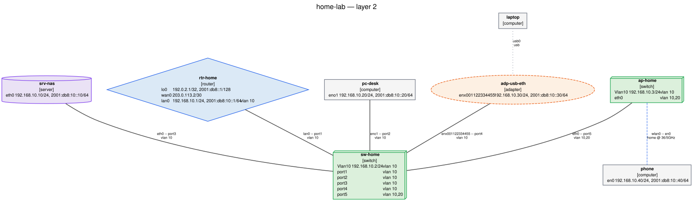

# netgraph

Declare your network — switches, routers, hubs, computers, servers, cables, adapters,
tunnels and patch panels — in a folder tree of YAML files, then render it as a network
graph.

netgraph reads the tree, checks that the documents agree with each other, and draws the
result as SVG, PNG, PDF, Graphviz DOT, Mermaid or JSON. It can also open the whole thing
in a browser — `netgraph web` — where the YAML is edited on one side, drawn on the other,
and every node and link answers a hover with its interfaces, addresses, VLANs and cabling.



<sub>Produced from [`examples/home-lab`](examples/home-lab) with
`netgraph -i examples/home-lab render --layer l2 --title "home-lab — layer 2" -f svg -o docs/images/home-lab.svg`.</sub>

> **Status: early development (0.1.0).** The schema, loader, validator, renderers and CLI
> work end to end; the schema may still change before 1.0. See
> [§12 of the specification](docs/schema.md#12-compatibility-policy).

## Why

Network documentation rots because the diagram and the truth live in different places.
The diagram is a drawing: nothing checks it, nothing regenerates it, and the day someone
re-patches a link it starts lying.

netgraph puts the source of truth in reviewable, diffable YAML next to the rest of your
infrastructure code, and generates the picture on demand. Because the files are structured
rather than drawn, they can be *checked*: a cable that names a port which no longer exists
is an error, not a line that happens to end in the wrong place.

Field names and value spaces follow RFC 8343 (`ietf-interfaces`), RFC 8344 (`ietf-ip`) and
the IEEE 802.1Q bridge model, so an inventory stays comparable with what a device actually
reports — see [`docs/yang-mapping.md`](docs/yang-mapping.md).

## Installation

netgraph needs **Python 3.10 or newer**.

```bash
pip install -e .            # from a checkout
pip install -e '.[dev]'     # including the development tooling
```

The `svg`, `png`, `pdf` and `html` formats are produced by running the Graphviz `dot`
binary, which is a system package rather than a Python one:

```bash
sudo apt install graphviz        # Debian / Ubuntu
sudo dnf install graphviz        # Fedora / RHEL
brew install graphviz            # macOS
choco install graphviz           # Windows
```

Check it with `dot -V`. The `dot`, `mermaid` and `json` formats are written by netgraph
itself and need none of that, so if you only want DOT to feed into another tool you can
skip the install. Full instructions, including the editor setup that gives you
completion and inline errors, are in
[`docs/getting-started.md`](docs/getting-started.md).

Or install nothing at all. [`docker-compose.yml`](docker-compose.yml) runs the CLI, the
live preview and the browser editor out of a container that already has Graphviz in it:

<!-- norun: needs a Docker daemon -->
```bash
docker compose run --rm netgraph validate    # see docs/docker.md
```

## Quickstart

Four commands. `init` writes a small, valid inventory; edit it into your own network.

<!-- norun: writes a directory in the reader's workspace, and stops in an editor -->
```bash
netgraph init my-network && cd my-network
$EDITOR devices/sw-office.yaml          # your switches, routers, hosts
netgraph validate                       # do the documents agree with each other?
netgraph render -f svg -o network.svg   # draw it
```

The tree it writes looks like this — the folder a document sits in becomes its namespace,
and nothing else about the layout carries meaning:

```text
my-network/
├── netgraph.toml          # optional: default flags for this inventory
├── schema/                # JSON Schema, wired into your editor
├── devices/
│   ├── rtr-gw.yaml        # kind: router
│   ├── sw-office.yaml     # kind: switch
│   └── pc-alice.yaml      # kind: computer
└── cables/
    └── links.yaml         # which port is patched into which port
```

A device is a name, a kind and its interfaces; a cable is two endpoints:

```yaml
apiVersion: netgraph.dev/v1alpha1
kind: switch
metadata:
  name: sw-office
spec:
  interfaces:
    - name: port1
      type: ethernet
      vlan: { mode: access, vid: 10 }
    - name: port2
      type: ethernet
      vlan: { mode: access, vid: 10 }
```

That inventory is checked in as [`examples/quickstart`](examples/quickstart), so the
following really is what it prints:

<!-- run: cwd=examples/quickstart -->
```console
$ netgraph validate
no problems found
$ netgraph list devices
NAME               KIND      PORTS  ADDRESS           VLANS
-----------------  --------  -----  ----------------  -----
devices/pc-alice   computer      1  192.168.10.20/24  10
devices/rtr-gw     router        2  203.0.113.2/30    10
devices/sw-office  switch        2  -                 10
```


Point a cable at a port that does not exist and `validate` says so, with the file, the
line and a rule id — which is the whole point. The step-by-step version of this, built by
hand and explained line by line, is
[`docs/getting-started.md`](docs/getting-started.md).

**Already have a network?** [`netgraph import`](docs/commands/import.md) builds the first
inventory from output you collect on the devices themselves — LLDP neighbours, `ip -j addr
show`, or the cabling list you already keep — so it starts a diff away from correct
instead of a weekend of typing:

<!-- norun: needs captures collected on live devices, and uses a shell pipeline -->
```bash
lldpctl -f json > collected/"$(hostname -s)".lldp.json    # on each device
netgraph import -o my-network collected/*.json
```

## The commands

`netgraph [GLOBAL OPTIONS] COMMAND [OPTIONS] [ARGS]`. The inventory is named once, with
the global `-i/--inventory`, and defaults to the current directory. Data goes to stdout
and commentary to stderr, so `netgraph render -f json | jq` and `netgraph validate >
report.txt` both do what they look like they do.

<!-- generated: command-index base=docs/commands/ -->
| Command | What it does | Reference |
|---|---|---|
| [`netgraph init`](docs/commands/init.md) | Scaffold a new inventory, ready to validate and render. | [init.md](docs/commands/init.md) |
| [`netgraph import`](docs/commands/import.md) | Build a first inventory from output captured on live devices. | [import.md](docs/commands/import.md) |
| [`netgraph validate`](docs/commands/validate.md) | Check the inventory; the gate for CI and pre-commit. | [validate.md](docs/commands/validate.md) |
| [`netgraph fmt`](docs/commands/fmt.md) | Rewrite inventory YAML into the canonical form. | [fmt.md](docs/commands/fmt.md) |
| [`netgraph render`](docs/commands/render.md) | Draw the graph as SVG, PNG, PDF, DOT, Mermaid, JSON or HTML. | [render.md](docs/commands/render.md) |
| [`netgraph watch`](docs/commands/watch.md) | Re-render on every save, optionally serving the result. | [watch.md](docs/commands/watch.md) |
| [`netgraph web`](docs/commands/web.md) | Edit the YAML and see the diagram side by side in a browser. | [web.md](docs/commands/web.md) |
| [`netgraph path`](docs/commands/path.md) | Trace how two elements reach each other, hop by hop. | [path.md](docs/commands/path.md) |
| [`netgraph list`](docs/commands/list.md) | Tabulate devices, cables, tunnels, VLANs, BSSs or subnets. | [list.md](docs/commands/list.md) |
| [`netgraph ipam`](docs/commands/ipam.md) | Report utilisation, free space, overlaps and aggregates. | [ipam.md](docs/commands/ipam.md) |
| [`netgraph export`](docs/commands/export.md) | Emit hosts files, DNS zones, Ansible, Prometheus, cable lists. | [export.md](docs/commands/export.md) |
| [`netgraph show`](docs/commands/show.md) | Print one element as it was resolved, expansions included. | [show.md](docs/commands/show.md) |
| [`netgraph rules`](docs/commands/rules.md) | List the validation rules and their ids. | [rules.md](docs/commands/rules.md) |
| [`netgraph schema`](docs/commands/schema.md) | Write the JSON Schema for editor completion. | [schema.md](docs/commands/schema.md) |
| [`netgraph config show`](docs/commands/config.md) | Show the resolved settings and where each value came from. | [config.md](docs/commands/config.md) |
| [`netgraph completion`](docs/commands/completion.md) | Print the shell completion script. | [completion.md](docs/commands/completion.md) |
<!-- /generated -->

Every flag of every command, the global options and the exit codes:
[`docs/commands/`](docs/commands/README.md). Those tables are generated from the CLI
itself and checked by the test suite, so they cannot drift from the code.

## One inventory, several questions

The files describe the network once; each command asks something different of them.

| You want to know | Ask |
|---|---|
| does the documentation contradict itself? | [`netgraph validate`](docs/validation.md) |
| what does the physical topology look like? what does VLAN 10 reach? which subnets exist? | [`netgraph render --layer l1\|l2\|l3`](docs/rendering.md) |
| what runs inside which tunnel? | [`netgraph render --layer overlay`](docs/rendering.md#overlay-tunnels-and-what-runs-inside-what) |
| which SSID is on which channel, in which VLAN? | [`netgraph list bss`](docs/commands/list.md) |
| what is in rack 3, and at which units? | [`netgraph render --layer rack`](docs/rendering.md#rack-a-front-elevation-per-cabinet) |
| how does this host reach that one, hop by hop? | [`netgraph path`](docs/paths.md) |
| how full is that /24, and where is the next free /28? | [`netgraph ipam`](docs/ipam.md) |
| what should `/etc/hosts`, the DNS zone, the Ansible inventory, the pull list or the routing script say? | [`netgraph export`](docs/export.md) |
| what did that template and that interface range actually expand to? | [`netgraph show`](docs/commands/show.md) |

Two of them are worth seeing. Nothing in the YAML declares a subnet: the layer-3 view and
`list subnets` both derive the prefixes from the addresses the interfaces carry, which is
why they cannot disagree with the configuration,

<!-- run: -->
```console
$ netgraph -i examples/home-lab list subnets
SUBNET            IP  ADDRESSES  ELEMENTS  VLANS
----------------  --  ---------  --------  -----
192.0.2.1/32       4          1         1  -
192.168.10.0/24    4          7         7  10
203.0.113.0/30     4          1         1  -
2001:db8::1/128    6          1         1  -
2001:db8:10::/64   6          5         5  10
```

and `netgraph path` traces the route two hosts in different sites actually take, naming
the ingress and egress port at every hop:

<!-- run: -->
```console
$ netgraph -i examples/campus path pc-north-01 pc-south-01
sites/north/hosts/pc-north-01 -> sites/south/hosts/pc-south-01: 2 paths
  source       sites/north/hosts/pc-north-01  [computer]
  destination  sites/south/hosts/pc-south-01  [computer]
  layer        3, routed (ipv4)
  showing      the shortest; pass --all for the rest
  note         no layer-2 path: the two elements are in no common broadcast domain, so the trace looked for a routed one
...
```

## Where to go next

[`docs/README.md`](docs/README.md) is the index, with an "if you want to X, read Y" table
over the whole set. The pages a new reader wants first:

| Page | What it answers |
|---|---|
| [`docs/getting-started.md`](docs/getting-started.md) | Install it, build a three-device inventory by hand, validate, render, interrogate. Ends with the editor wiring. |
| [`docs/inventory-layout.md`](docs/inventory-layout.md) | How to organise the files: namespaces, references, templates, interface ranges, and a layout for a multi-site estate. |
| [`docs/rendering.md`](docs/rendering.md) | The seven layers, the filters, namespace collapsing, link bundling, icon themes, and what each output format is for. |
| [`docs/validation.md`](docs/validation.md) | What the checks are, what a finding means, and the four ways to say "not here". |
| [`docs/schema-reference.md`](docs/schema-reference.md) | Every field of every kind, with its type, default and YANG counterpart. |
| [`docs/schema.md`](docs/schema.md) | The normative specification, if you want the reasoning as well as the rules. |
| [`docs/ci.md`](docs/ci.md) | Making a pull request fail when the inventory stops adding up. |
| [`docs/configuration.md`](docs/configuration.md) | `netgraph.toml`, so you type the flags once instead of every time. |
| [`docs/docker.md`](docs/docker.md) | The image and the compose file: the CLI, the preview and the editor in a container. |

## Examples

Five complete, self-consistent inventories live under [`examples/`](examples/README.md) —
from the three-device quickstart to a 22-device campus with nested namespaces, a
five-tunnel overlay with VXLAN inside IPsec, and a patch room with two racks of structured
cabling. All of them validate clean with no suppressions, and the test suite renders them
on every commit, so they stay executable rather than aspirational.

<!-- run: -->
```console
$ netgraph -i examples/patch-room validate
no problems found
```

## As a library

Everything the CLI does is available from Python: `load_tree` reads a folder into an
`Inventory`, `validate` returns findings, `build_graph` resolves the topology, and the
renderers are pure functions of the graph. See
[Using it as a library](docs/architecture.md#using-it-as-a-library).

## Contributing

[`CONTRIBUTING.md`](CONTRIBUTING.md) has the dev setup and the gates (ruff, ruff format,
mypy, pytest with a coverage floor), plus recipes for adding a validation rule or a
renderer. [`docs/architecture.md`](docs/architecture.md) is the ten-minute orientation:
the pipeline is `load_tree` → `validate` → `build_graph` → `filter`/`aggregate` →
renderers, and each stage's invariants are written down.

## License

[MIT](LICENSE)
