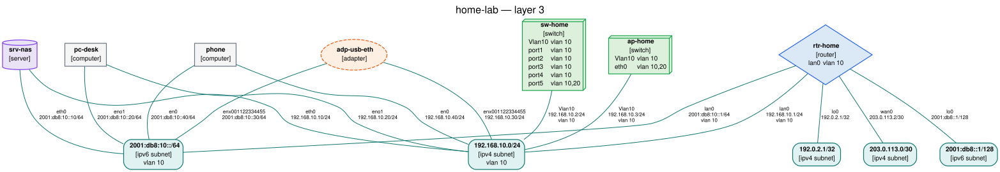
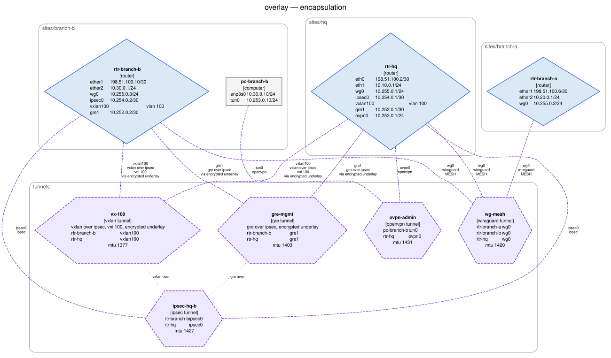
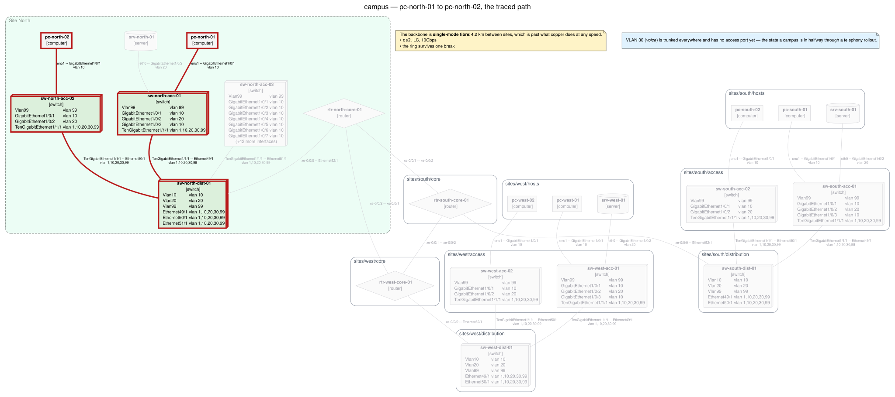

# netgraph

Declare your network — switches, routers, hubs, computers, servers, cables,
adapters, tunnels and patch panels — in a folder tree of YAML files, then render it as a
network graph.

netgraph reads the tree, checks that the documents agree with each other, and
draws the result as SVG, PNG, PDF, Graphviz DOT, Mermaid or JSON. It can also
open the whole thing in a browser — `netgraph web` — where the YAML is edited
on one side, drawn on the other, and every node and link answers a hover with
its interfaces, addresses, VLANs and cabling.


<sub>Produced from [`examples/home-lab`](examples/home-lab) with
`netgraph -i examples/home-lab render --layer l2 --title "home-lab — layer 2" -f svg -o docs/images/home-lab.svg`.</sub>

> **Status: early development (0.1.0).** The schema, loader, validator,
> renderers and CLI work end to end; the schema may still change before 1.0.
> See [§12 of the specification](docs/schema.md#12-compatibility-policy).

## Why

Network documentation rots because the diagram and the truth live in different
places. The diagram is a drawing: nothing checks it, nothing regenerates it,
and the day someone re-patches a link it starts lying.

netgraph puts the source of truth in reviewable, diffable YAML next to the rest
of your infrastructure code, and generates the picture on demand. Because the
files are structured rather than drawn, they can be *checked*: a cable that
names a port which no longer exists is an error, not a line that happens to end
in the wrong place.

Field names and value spaces follow RFC 8343 (`ietf-interfaces`), RFC 8344
(`ietf-ip`) and the IEEE 802.1Q bridge model, so an inventory stays comparable
with what a device actually reports — see
[`docs/yang-mapping.md`](docs/yang-mapping.md).

## Installation

netgraph needs **Python 3.10 or newer**.

```bash
pip install -e .            # from a checkout
pip install -e '.[dev]'     # including the development tooling
```

### Graphviz is a system prerequisite

The `svg`, `png`, `pdf` and `html` formats are produced by running the Graphviz
`dot` binary, which is a system package rather than a Python one — so `pip` alone
is not enough:

```bash
sudo apt install graphviz        # Debian / Ubuntu
sudo dnf install graphviz        # Fedora / RHEL
brew install graphviz            # macOS
choco install graphviz           # Windows
```

Check it with `dot -V`. The `dot`, `mermaid` and `json` formats are written by
netgraph itself and work without it — so if you only need DOT output to feed
into another tool, you can skip the install.

## Quickstart

Five minutes, three devices, from an empty directory.

In a hurry? [`netgraph init`](#netgraph-init) writes exactly the tree this
section builds — including the editor wiring — and it validates and renders
straight away:

```bash
netgraph init my-network && cd my-network
netgraph validate
netgraph render -f svg -o network.svg
```

Already have a network? [`netgraph import`](#netgraph-import) builds the tree
from output you collect on the devices themselves — LLDP neighbours, `ip -j addr
show`, or the cabling list you already keep — so the first inventory is a diff
away from correct rather than a weekend of typing:

```bash
lldpctl -f json > collected/"$(hostname -s)".lldp.json    # on each device
netgraph import -o my-network collected/*.json
```

The rest of this section builds the same thing by hand, which is the part worth
reading once.

### 1. Make a folder

```bash
mkdir -p my-network/devices my-network/cables && cd my-network
```

The layout is up to you: netgraph loads every `*.yaml` and `*.yml` under the
root, at any depth. Directories become *namespaces*, so `devices/rtr-gw` is the
full name of the router below, and names only have to be unique within their
own folder.

### 2. Declare a router — `devices/rtr-gw.yaml`

```yaml
apiVersion: netgraph.dev/v1alpha1
kind: router
metadata:
  name: rtr-gw
  labels: {site: office}
spec:
  vendor: MikroTik
  vlans:
    - id: 10
      name: office
  interfaces:
    - name: wan0
      type: ethernet
      description: ISP hand-off
      mtu: 1500
      ipv4:
        addresses: [203.0.113.2/30]
    - name: lan0
      type: ethernet
      description: Downlink to the switch
      mac: 00:1e:8c:aa:00:01
      mtu: 1500
      vlan:
        mode: access
        access_vlan: 10
      ipv4:
        addresses: [192.168.10.1/24]
```

Every document has the same four keys: `apiVersion`, `kind`, `metadata` and
`spec`. `203.0.113.2/30` is shorthand — write
`{ip: 203.0.113.2, prefix_length: 30}` instead if you prefer it explicit, or
`netmask: 255.255.255.252` if that is how your notes are written. All three
normalise to the same value.

### 3. Declare a switch — `devices/sw-office.yaml`

```yaml
apiVersion: netgraph.dev/v1alpha1
kind: switch
metadata:
  name: sw-office
  labels: {site: office}
spec:
  vlans:
    - id: 10
      name: office
  interfaces:
    - name: port1
      type: ethernet
      description: Uplink to rtr-gw
      mtu: 1500
      vlan: {mode: access, access_vlan: 10}
    - name: port2
      type: ethernet
      description: Desk
      mtu: 1500
      vlan: {mode: access, access_vlan: 10}
```

The switch has no IP address at all, which is the point: it is a layer-2
bridge, and its ports carry VLAN membership rather than addressing. (A
management address would go on a `type: vlan` SVI — putting one on a bridge
port is warning `W104`.)

### 4. Declare a computer — `devices/pc-alice.yaml`

```yaml
apiVersion: netgraph.dev/v1alpha1
kind: computer
metadata:
  name: pc-alice
  labels: {site: office}
spec:
  interfaces:
    - name: eno1
      type: ethernet
      mac: 00:1e:8c:bb:00:01
      mtu: 1500
      ipv4:
        addresses: [192.168.10.20/24]
```

Note what is *absent*: no `vlan` block. The host sends untagged frames and
inherits the VLAN of the access port facing it. That is the expected pairing,
and netgraph knows not to complain about it.

### 5. Connect them — `cables/links.yaml`

One file, two documents, separated by `---`:

```yaml
apiVersion: netgraph.dev/v1alpha1
kind: cable
metadata: {name: cbl-rtr-sw}
spec:
  endpoints: [rtr-gw:lan0, sw-office:port1]
  medium: copper
  speed: 1Gbps
---
apiVersion: netgraph.dev/v1alpha1
kind: cable
metadata: {name: cbl-sw-alice}
spec:
  endpoints: [sw-office:port2, pc-alice:eno1]
  medium: copper
  speed: 1Gbps
```

A cable is its own element, not a field on a device. It joins exactly two
interfaces, written as `device:interface`, and the order carries no meaning.

### 6. Check it

```console
$ netgraph validate
no problems found
```

Try breaking something — rename `port2` to `port9` in the cable — and you get
the file, the document index, the line, the rule id and a message that lists
the interfaces the switch actually has:

```console
$ netgraph validate
errors (1):
  cables/links.yaml#1:9  E001  cable 'cables/cbl-sw-alice' endpoint sw-office:port9: 'devices/sw-office' has no interface 'port9'; it declares 'port1', 'port2'

1 error
```

`links.yaml#1:9` is the file, the second document in it (0-based) and line 9.

### 7. Draw it

```bash
netgraph render -f svg -o topology.svg
```

<p align="center"></p>

### 8. Ask questions about it

```console
$ netgraph list devices
NAME               KIND      PORTS  ADDRESS           VLANS
-----------------  --------  -----  ----------------  -----
devices/pc-alice   computer      1  192.168.10.20/24  10
devices/rtr-gw     router        2  203.0.113.2/30    10
devices/sw-office  switch        2  -                 10

$ netgraph list subnets
SUBNET           IP  ADDRESSES  ELEMENTS  VLANS
---------------  --  ---------  --------  -----
192.168.10.0/24   4          2         2  10
203.0.113.0/30    4          1         1  -
```

And the question the diagram cannot answer on its own:

<!-- path-example -->

```console
$ netgraph path pc-alice rtr-gw
devices/pc-alice -> devices/rtr-gw: 1 path
  source       devices/pc-alice  [computer]
  destination  devices/rtr-gw  [router]
  layer        2, switched
  vlan         10 (assumed by the trace)

path 1 of 1 · 2 hops · vlan 10
   1  devices/pc-alice  [computer]
      out eno1                  192.168.10.20/24
      ->  cable cbl-sw-alice  (copper, 1Gbps)  vlan 10
   2  devices/sw-office  [switch]
      in  port2
      out port1
      ->  cable cbl-rtr-sw  (copper, 1Gbps)  vlan 10
   3  devices/rtr-gw  [router]
      in  lan0                  192.168.10.1/24
```

See [`netgraph path`](#netgraph-path).

That is the whole loop: write YAML, validate, render. Everything below is
detail.

While you are still editing, let netgraph run the loop for you:

```bash
netgraph watch --serve
```

Every save re-validates and re-renders, and the page at
<http://127.0.0.1:8080/> updates itself. See
[`netgraph watch`](#netgraph-watch).

The finished inventory is checked in as
[`examples/quickstart`](examples/quickstart), and the test suite validates and
renders it on every run — so if you got a different answer than this page
promised, that is a bug in netgraph rather than in your typing.

## Declaring a 48-port switch without typing it 48 times

A real access layer is dozens of near-identical documents, each of which is
dozens of near-identical ports. Two mechanisms remove the repetition without
weakening any check: both are applied by the loader before validation, so the
validator, the graph and every renderer still see plain interfaces and plain
devices.

**Interface ranges** (`docs/schema.md` §6.2.5). One entry may declare `range`
instead of `name`:

```yaml
interfaces:
  - range: GigabitEthernet1/0/[1-48]
    type: ethernet
    description: Access port {}          # {} and %d are the port number
    enabled: false
    vlan: {mode: access, access_vlan: 10}
```

Several spans expand as an odometer, rightmost fastest — `ge-[0-1]/0/[0-3]`
yields `ge-0/0/0` … `ge-1/0/3` — and the width of a span's low bound is its
zero padding, so `[01-12]` yields `01` … `12`. A document expands to at most
4096 interfaces; `eth[1-99999999]` is a diagnostic, not an out-of-memory kill.

**Device templates** (`docs/schema.md` §6.6). A `kind: template` document is a
named partial device `spec`; a device merges it in with `spec.from`:

```yaml
apiVersion: netgraph.dev/v1alpha1
kind: switch
metadata:
  name: sw-north-acc-03
spec:
  from: templates/c9200l-48p
  bridge: {address: '00:1b:0d:01:a3:ff'}
  interfaces:
    - name: Vlan99
      ipv4: [10.1.99.13/24]
```

Nine lines instead of two hundred, and
[`examples/campus`](examples/campus/sites/north/access/switches.yaml) has that
switch next to two written out longhand so the two can be compared. The merge
rules are stated exactly in §6.6.1 and are worth knowing in full, but in short:
the device's own keys win, mappings merge key by key, `interfaces` merge by
`name`, and every other list the device declares replaces the template's
outright.

Templates are not elements — they never appear in a graph, in `netgraph list`,
or in validation output. The one place a template does surface is as the source
location of a field it contributed: a value the template got wrong is reported
against the template's file and line, with a note naming the device that
inherited it, so fifty devices do not report fifty copies of one mistake.

```text
templates/access-switch.yaml#0:52  NG-I011  spec.interfaces[2].mtu: mtu 1000 is below
  the IPv6 minimum of 1280 but the interface carries IPv6 addresses (inherited by
  'sw-north-acc-03' through 'spec.from: templates/c9200l-48p')
```

The file and the line are the template's; the note says who tripped over it.

Use `netgraph show NAME --raw` to read a device as written and
`netgraph show NAME` to read it merged.

## CLI reference

```
netgraph [GLOBAL OPTIONS] COMMAND [OPTIONS] [ARGS]
```

Running `netgraph` with no command prints the help. Every command that reads an
inventory reads the one named by the global `-i/--inventory` option; `init` and
`import`, which *write* one, take their target as an argument and as `-o`
respectively.

**Output discipline: data on stdout, commentary on stderr.** `render` writes
the diagram to stdout when no `--output` is given, so its findings and progress
notes go to stderr. `netgraph render -f json | jq` and
`netgraph validate > report.txt` both do what they look like they do. Colour is
used only when the stream is a terminal.

### Global options

| Option | Default | Effect |
|---|---|---|
| `-i, --inventory PATH` | current directory | Root folder of the YAML inventory tree, or a single YAML file. Must exist. |
| `-q, --quiet` | off | Only report errors. |
| `-v, --verbose` | off | Increase verbosity; repeatable (`-vv`). Progress notes go to stderr. |
| `--color` / `--no-color` | auto | Force coloured output on or off. Auto-detected from the terminal. |
| `-V, --version` | | Print the version and exit. |
| `-h, --help` | | Print help and exit. Works on every subcommand. |

### `netgraph init`

Scaffold a working inventory in an empty or new directory. The tree it writes
validates clean and renders at every layer before a line has been edited, and
each document carries a `yaml-language-server` modeline pointing at a JSON
Schema written alongside it — so the first key you type is completed and the
first typo underlined.

```console
$ netgraph init my-network
created 7 files in my-network:
  netgraph.toml
  .gitignore
  schema/netgraph.schema.json
  devices/rtr-gw.yaml
  devices/sw-office.yaml
  devices/pc-alice.yaml
  cables/links.yaml

next steps:
  cd my-network
  netgraph validate
  netgraph render -f svg -o network.svg
```

| Option | Default | Effect |
|---|---|---|
| `PATH` | current directory | Where to write. Created, with its parents, when it does not exist. |
| `--minimal` | off | Write a single commented envelope template instead of the three-device example topology. The tree then declares no elements at all. |
| `--force` | off | Write into a directory that already holds something, overwriting files of the same name. Without it an occupied directory is refused and left untouched. |
| `--schema` / `--no-schema` | `--schema` | Write `schema/netgraph.schema.json` and the modeline that points each document at it. `--no-schema` leaves the editor unwired. |

The example tree is the one the [quickstart](#quickstart) builds: a router, a
switch, a host and the two cables between them. `netgraph.toml` is written with
every `[validate]` key commented out and explained, and the `.gitignore` keeps
rendered diagrams — `*.svg`, `*.png`, `*.pdf`, `*.dot`, `*.mmd`, `/out/` — out
of the history while leaving the generated schema in it.

### `netgraph import`

`init` is for a network you are about to build. `import` is for the one you
already have: it turns machine-readable output collected from real devices into
a starting inventory, so the first tree is a diff away from correct instead of a
weekend of transcription.

**No network access, ever.** netgraph opens no socket, reads no credential and
runs nothing on a device. You run the collection command — the exact lines are
[below](#collecting-the-input) — and hand netgraph what it printed, from a file
or from a pipe. The command works fine on a laptop with no route to the network
it is documenting.

```console
$ netgraph import -o net --exclude 'veth*' collected/*.json collected/patch-panel.csv
4 notes about what was not imported:
  srv-hyper.addr.json: 'lo' is the kernel loopback; it terminates no cable and holds only host-scope addresses, so it was not imported
  srv-hyper.addr.json: 'wg0' is a wireguard tunnel; netgraph models a tunnel as its own document naming both ends (docs/schema.md §14) and 'ip' shows only this end, so it was not imported
  ...

wrote 9 files to net:
  devices/ap-lobby.yaml
  devices/pc-alice.yaml
  ...
  cables/links.yaml
  schema/netgraph.schema.json

imported 7 devices and 7 cables from 4 inputs

warnings (15):
  ...
I002, W101, W105 are expected of an imported tree: a port whose neighbour was
never captured terminates no cable, and a device only a neighbour named has no
configuration of its own. Capture the missing hosts and re-run, or fill the gaps
in by hand — they are not errors in what was imported.
```

The tree is written in the layout `init` produces — `devices/<name>.yaml`, one
document per device, plus `cables/links.yaml` — with a `yaml-language-server`
modeline on every file, so the result opens in an editor with completion already
working.

#### Collecting the input

Run these on each device and keep the output in one directory, one file per
host named after it. Nothing else is needed.

| Dialect | What to run | What it gives |
|---|---|---|
| `lldp` | `lldpctl -f json > "$(hostname -s).lldp.json"`<br>or `lldpcli -f json show neighbors > …` | Both ends of every link with a neighbour: device names and the port pair, which is exactly a `cable`. Also the neighbour's kind, from its advertised system capabilities. |
| `iproute` | `ip -j addr show > "$(hostname -s).addr.json"` | One host in full: interfaces, MAC addresses, MTUs, admin state, IPv4/IPv6 addresses, and — via `linkinfo` — bridges, bonds and VLAN sub-interfaces. `ip -j link show` also works and is a subset; pass both and they merge. |
| `csv` | whatever produces `device,port,device,port` rows | The cabling you already have written down. Optional fifth and sixth columns are `medium` and `label`. A header row is detected and skipped. |

On a Cisco or Juniper box `lldpctl` is not available, but the neighbours are:
`show lldp neighbors detail` and its JSON forms are not read by this command —
turn them into the four-column CSV instead, which is a one-line `awk` and is
what the CSV dialect exists for.

**Why CSV and not NetJSON.** NetJSON's `NetworkGraph` describes nodes and links,
but a link has no notion of a *port*: its ends are node ids. Importing it would
have to drop the interface pair — the one thing that makes a netgraph `cable` a
cable rather than a line on a picture — or invent interface names to hang the
link on, which is precisely what this command refuses to do. It would also cost
several hundred lines of shape-guessing across the NetworkGraph,
NetworkCollection and DeviceConfiguration variants. Four columns carry exactly
what a cable needs, and where you do have NetJSON, one `jq` produces them:

```console
$ jq -r '.links[] | [.source, "?", .target, "?"] | @csv' topology.json > links.csv
```

(then replace the `?`s with the ports, which is the information NetJSON does not
hold.)

#### Naming the host a capture came from

An `lldpctl` or `ip` capture describes one host and never says which. netgraph
takes the name from the first of these that applies:

1. `NAME=path` on the argument — `netgraph import sw-core=neighbors.json`;
2. `--host NAME`, which applies to **every** input of that run, so
   `--host pc1 link.json addr.json` means the obvious thing;
3. the file name up to its first dot — `sw-core-01.lldp.json` → `sw-core-01`.

A name that came from a file name is recorded as such in the generated
document, because it is the one field the capture did not supply.

| Option | Default | Effect |
|---|---|---|
| `[NAME=]INPUT...` | | Capture files, or `-` for standard input. Several may be given and they are merged into one inventory. |
| `--from DIALECT` | `auto` | `lldp`, `iproute`, `csv`, or `auto` to sniff each input separately — an LLDP capture is a JSON object with an `lldp` key, an iproute capture is a JSON array of link records, and anything that is not JSON is the CSV. Sniffing is what makes `netgraph import collected/*` work on a directory holding all three. |
| `--host NAME` | | The device every input was captured on. See above. |
| `-o, --output DIR` | current directory | Inventory root to write the `devices/` and `cables/` tree into. |
| `--dry-run` | off | Print the tree to stdout and write nothing. |
| `--force` | off | Overwrite files already in the output tree. Without it every clash is named and nothing is touched. |
| `--schema` / `--no-schema` | `--schema` | Point each document at `schema/netgraph.schema.json` with a modeline, writing the schema when the tree does not already hold one. |
| `--exclude PATTERN` | none | Leave out interfaces whose name matches this glob. Applies to `iproute` captures, where `veth*` and `docker*` are rarely part of a physical topology. Repeatable. |

#### What it will and will not write

The generated YAML is meant to be edited and committed, not regenerated, so it
is formatted for a reader: fields in the order of
[`docs/schema.md`](docs/schema.md), a header explaining where the file came
from, and a comment beside anything netgraph *concluded* rather than read.

Nothing is invented. A field no capture covers is absent — there is no
placeholder `vendor:`, no example address, no `description: TODO`. Where the
kind of a device cannot be determined the document says `kind: computer` and
says why, rather than promoting a box that happens to forward packets into a
`router`:

```yaml
# inferred: nothing in the captured output states what this device is; 'computer'
# is netgraph's neutral default — correct it by hand
kind: computer
```

Four things are concluded rather than observed, and each is commented in place:

* **A cable's `medium`.** The schema requires one and no capture reports it, so
  every cable reads `copper` unless a CSV column said otherwise. Fix the fibre
  runs before trusting an `l1` diagram.
* **A device's kind, from LLDP capabilities.** A neighbour advertising `Bridge`
  becomes a `switch`, `Router` a `router`, `Repeater` a `hub`.
* **A trunk under a VLAN sub-interface.** `eno1.100` can only receive frames if
  `eno1` carries VLAN 100 tagged, so the parent gets
  `vlan: {mode: trunk, trunk_vlans: [100]}`. `ip` never reports a port's VLAN
  set, so the list is a *minimum* — extend it.
* **The VLAN database**, from the VLAN ids observed on the ports. Names and
  descriptions are not reported by anything, so add those by hand.

Four things are deliberately left out, each reported on stderr rather than
dropped silently: the kernel loopback, link- and host-scope addresses
(`fe80::`, `127.0.0.1` — facts about a running kernel, not configuration), the
MAC a bridge, bond or VLAN sub-interface borrows from what is underneath it, and
tunnel interfaces, since netgraph models a tunnel as its own document naming
both ends ([`docs/schema.md`](docs/schema.md) §14) and `ip` shows only one end.

#### The findings afterwards are expected

An imported inventory is *partial* by construction: LLDP shows only the ports
that have a neighbour, `ip` shows one host, and a device nobody captured exists
only because a neighbour named it. `import` runs the validator over what it
wrote and names the rules that follow from that — `I002` (a port terminates no
cable), `W101` (an interface has no address), `W103`, `W105`, `W109`, `W113`,
`W121` — as expected rather than wrong. They are the gaps to fill, by capturing
the missing hosts and re-running, or by editing.

Anything reported as an **error** is not expected, and `import` exits 1 when the
tree it wrote does not validate.

### `netgraph validate`

Check the inventory for schema and semantic problems. Exits 1 when anything is
reported as an error, 0 otherwise — so it drops straight into CI.

| Option | Default | Effect |
|---|---|---|
| `--strict` | off | Promote every warning to an error, so any finding fails the run. Can only turn strictness on; `netgraph.toml` decides otherwise. |
| `--disable RULE` | none | Silence a rule by id (`E001`, `NG-C002`, `*`). Repeatable. Adds to what `netgraph.toml` already ignores. |
| `-F, --output-format` | `text` | `text` to read; `json`, `sarif` or `github` for automation. |

Findings are grouped by severity, most severe first, and each line reads
`file.yaml#doc:line  RULE  message`. See
[`docs/validation-rules.md`](docs/validation-rules.md) for every rule.

The three structured formats put their document on stdout and move the human
summary to stderr, so the output stays pipeable; `--quiet` drops that summary
and never the document. `json` is a documented envelope, `sarif` is SARIF 2.1.0
for GitHub code scanning, and `github` emits workflow commands that annotate a
pull request in place:

```console
$ netgraph -i inventory validate -F sarif --strict > netgraph.sarif
$ netgraph -i inventory validate -F github
::error file=inventory/cables/links.yaml,line=8,col=7,title=E001 unknown cable endpoint::cable 'cbl-core-desk' endpoint pc-desk:eth0: no element named 'pc-desk' is declared in this inventory
```

[`docs/ci.md`](docs/ci.md) documents all three, plus the composite GitHub Action
and the pre-commit hook this repository ships.

### `netgraph fmt`

Rewrite inventory YAML in its one canonical form — two-space indent, keys in
schema order, one quoting rule, comments and blank lines untouched. The way
`gofmt` and `ruff format` do it for code, so that how a file is laid out is
never what a review is spent on.

```console
$ netgraph fmt                       # rewrite the inventory -i points at
$ netgraph fmt inventory devices/    # rewrite these paths
$ netgraph fmt --check inventory     # write nothing; exit 1 and list what differs
$ netgraph fmt --diff inventory      # write nothing; print a unified diff
$ ... | netgraph fmt --stdin         # format a stream onto stdout
```

| Option | Default | Effect |
|---|---|---|
| `--check` | off | Write nothing. List the files that are not canonical, and exit 1 if there are any. For CI. |
| `--diff` | off | Write nothing. Print a unified diff of what would change, and exit 1 if there is one. |
| `--stdin` | off | Format the stream on stdin onto stdout. The path `-` means the same. |

`--check` and `--diff` cannot be combined. With no paths, the global
`-i`/`--inventory` decides what is formatted.

**Formatting never changes what a document means.** Every file is read back with
the same strict loader `validate` and `render` use and compared against what it
said before — as its validated model where the document validates, and as its
raw parsed data where it does not. A file that fails that comparison is left
exactly as it was, and the failure is reported as a bug in netgraph. Formatting
is also idempotent: running it twice produces the same bytes as running it once.
Both properties are tested over every document under `examples/` and
`tests/fixtures/`.

Discovery is the loader's, so `.netgraphignore` and the dot- and
underscore-prefix rules apply exactly as they do to `validate`: a file the
inventory would not read is a file `fmt` does not rewrite.

[`docs/format.md`](docs/format.md) defines the canonical form clause by clause,
including what `fmt` deliberately will not do — it canonicalises documents, it
does not repair them.

### `netgraph render`

Render the inventory as a network graph. **Validation always runs first**, and
errors refuse the render unless `--force` is given: a diagram silently drawn
from an inventory with a dangling cable is worse than no diagram.

| Option | Default | Effect |
|---|---|---|
| `-f, --format FORMAT` | `dot` | One of `dot`, `svg`, `html`, `png`, `pdf`, `mermaid`, `json`. `svg`, `html`, `png` and `pdf` need Graphviz; the other three do not. `html` is a self-contained interactive page — see [The interactive HTML page](#the-interactive-html-page). |
| `-o, --output FILE` | stdout | Write to this file instead of stdout. Parent directories are created. Required for `png` and `pdf` when stdout is a terminal. |
| `--layer physical\|l1\|l2\|l3\|overlay\|rack` | `l1` | Which view to draw — see [Layers](#layers-physical-l1-l2-l3-overlay-and-rack). `l1` is the physical topology, `l2` the same topology annotated with VLANs, `l3` the IP subnets and who is addressed in them, `overlay` the tunnels and what runs inside what, `physical` the cabling record with its patch panels, `rack` a front elevation per rack. Repeatable for `-f html`, which draws each layer and puts a switcher over them; every other format holds one layer, and asking for two is a usage error. |
| `--title TEXT` | none | Caption for the diagram. |
| `--show-ips` / `--no-show-ips` | on | Print configured IP addresses on the nodes. |
| `--show-vlans` / `--no-show-vlans` | on | Annotate nodes and links with VLAN membership. |
| `--group-by-namespace` | off | Draw each namespace as a visual group (a Graphviz cluster, a Mermaid subgraph). |
| `--collapse NS`, `--collapse-depth N` | off | Replace a namespace with one node standing for everything in it — see [Aggregation](#aggregation-one-node-per-site-one-line-per-bundle). |
| `--bundle-links` / `--no-bundle-links` | LAGs only | Draw parallel links between one pair of elements as one edge. |
| `--icons THEME\|DIR` | off | Draw each element as an icon instead of a plain shape — see [Icons](#icons). `cisco`, `none`, or a directory of your own. Graphviz formats only. |
| `--tooltips` / `--no-tooltips` | on | Carry the full record of every element — interfaces, addresses, VLANs, cabling — as hover text. `dot`, `svg` and `html` only; see [Interactive SVG](#interactive-svg-tooltips-links-and-ids). |
| `--link-template URL` | off | Link each element back to the YAML that declares it, e.g. `https://git.example.com/net/blob/main/{file}#L{line}`. `dot`, `svg` and `html` only. |
| `--element-ids` | off | Give every node, edge and namespace a stable `id` derived from its name, so the diagram can be deep-linked and styled. `dot` and `svg`; always on in `html`, which is built on them. |
| `--max-addresses N` | `4` | Longest address list spelled out under a node before it is abbreviated to "and N more". |
| `--rankdir TB\|LR\|BT\|RL` | `TB` | Layout direction. A wide network reads better left to right, a deep one top to bottom. Graphviz backends and `mermaid`. |
| `--profile NAME` | none | Apply the `[profile.NAME]` block of `netgraph.toml` — see [Configuration](#configuration). |
| `--show-config` | off | Print the settings this invocation resolves to, and where each came from, then exit. |
| `--strict` | off | Treat warnings as errors, which then also refuse the render. |
| `--force` | off | Render even when validation failed. The diagram may not match the files. |

Every option above except `-o/--output`, `--force` and `--show-config` can be
given a default in `netgraph.toml`, so a team retypes none of them; see
[Configuration](#configuration).

**Filters** narrow what is drawn. Values *within* one option are alternatives;
different options are combined with AND, so `--namespace sites/north --kind
switch` keeps the switches of that site only. An unset filter selects
everything, and filtering never changes what the remaining nodes say about
themselves.

| Option | Repeatable | Keeps |
|---|---|---|
| `--namespace NS` | yes | Elements in `NS` or in any namespace below it. |
| `--vlan VID` | yes | Elements participating in that VLAN (1–4094). A host on an untagged access port counts as a member. |
| `--kind KIND` | yes | Elements of that kind: `switch`, `router`, `hub`, `computer`, `server`, `adapter`, `patchpanel`. A cable is an edge and so is a tunnel, so neither is selectable; both follow whichever elements survive. |
| `--name GLOB` | yes | Elements whose short **or** fully-qualified name matches the shell-style glob. |
| `--neighbors-of NAME` | no | Only the neighbourhood of one element. An unknown name is a usage error, with suggestions. |
| `--depth N` | no | How many hops `--neighbors-of` reaches. Default 1. |

At `--layer l3` every filter still selects **elements**; the subnet nodes are
derived, so each one survives exactly as long as one selected element is still
addressed in it, and it then reports only those members. `--kind router` draws
the routers and the prefixes they route, never an empty prefix. `--neighbors-of`
counts a subnet as a hop, so depth 1 from a device reaches the prefixes it is
addressed in and depth 2 the other devices in them. `--group-by-namespace`
leaves subnets outside every group: a prefix spanning two sites belongs to
neither.

```bash
netgraph render -f json | jq '.nodes[].name'
netgraph render -f mermaid -o docs/topology.mmd
netgraph render --vlan 10 --layer l2 -f svg -o vlan-10.svg
netgraph render --layer l3 -f svg -o subnets.svg
netgraph render --neighbors-of sw-dist-01 --depth 2 -f svg -o around-dist.svg
netgraph render --kind switch --kind router --group-by-namespace -o core.dot
```

Mermaid's renderer refuses a diagram of more than 500 edges, and that ceiling is
a secure config a document is not allowed to raise for itself — so GitHub,
GitLab and `mmdc` will not draw one, however valid it is. `render` warns when it
crosses the line and names the filters that would bring it back down; `-f dot`
and `-f svg` have no such limit.

#### Aggregation: one node per site, one line per bundle

Every filter above removes detail by removing elements. Past a few hundred
devices that is the wrong question: you do not want *less* of the network, you
want all of it in less space. Two options summarise instead of narrowing, and
both run before the renderers, so `dot`, `svg`, `mermaid`, `json` and `html`
all get the same answer.

| Option | Repeatable | Draws |
|---|---|---|
| `--collapse NS` | yes | One node for `NS` and everything under it, labelled with the namespace, its element count per kind, and the VLANs and prefixes it participates in. |
| `--collapse-depth N` | no | The same, for every namespace `N` levels deep. |
| `--bundle-links` / `--no-bundle-links` | no | Fold every set of parallel links into one edge / fold none. Unset folds declared link aggregations only. |

`--collapse-depth 1` is the site-level overview of a large tree in one flag:

```bash
netgraph -i examples/campus render --collapse-depth 1 --group-by-namespace \
  --title "campus — one node per site" -f svg -o campus-collapsed.svg
```


Depth is counted from the **shallowest namespace that actually branches**. Every
element of `examples/campus` lives under `sites/`, so that directory is not a
level a reader distinguishes — nothing is outside it — and depth 1 means one
node per site rather than one node for the campus. Depth 2 would be one node per
tier inside each site.

Nothing is thrown away, only folded:

* Links **crossing** a boundary keep their identity and attach to the collapsed
  node — the three backbone fibres above are the same three cables, with the
  same labels and the same rates.
* Links **inside** one are counted on the label (`7 links inside`) rather than
  drawn, and named in full in the tooltip and in `-f json`.
* The collapsed node takes a tooltip and an `--element-ids` id exactly as a real
  node does, so a collapsed diagram is as deep-linkable as any other.
* `-f json` marks it `"type": "aggregate"` and gives it an `aggregate` object
  listing **every element it stands for**, so a consumer can never mistake one
  box for one device:

```console
$ netgraph -i examples/campus render --collapse-depth 1 -f json |
    jq '.nodes[0].aggregate | {namespace, elementCount, countsByKind}'
{
  "namespace": "sites/north",
  "elementCount": 8,
  "countsByKind": { "computer": 2, "router": 1, "server": 1, "switch": 4 }
}
```

**Link bundling** solves the other half. Four cables in a LAG, or three cables
and a tunnel, draw as a band of parallel lines that Graphviz stacks into noise;
a bundle draws one edge, labelled with the count, weighted by it so the layout
pulls the endpoints together, and carrying every member in its tooltip and in
`-f json`.

LAG members are bundled **by default**, because the inventory has already said
they are one logical link — a switch declaring

```yaml
- name: Port-channel1
  type: lag
  members: [GigabitEthernet1/0/1, GigabitEthernet1/0/2,
            GigabitEthernet1/0/3, GigabitEthernet1/0/4]
```

draws one edge labelled `Port-channel1 -- Port-channel1 / lag, 4 members /
4Gbps`, the sum of what the members carry. Nothing is guessed: two spare
cross-links running alongside that LAG stay two edges, and two distinct
port-channels between one pair of switches stay two bundles. `--bundle-links`
goes further and folds every set of parallel links, whatever the reason they are
parallel — a judgement about legibility rather than a claim about the
configuration, so it is opt-in and the resulting edge is *not* called a LAG.
`--no-bundle-links` draws every cable, which is what a cabling document wants.

```bash
netgraph render --collapse-depth 1 -f svg -o overview.svg      # sites only
netgraph render --collapse sites/north --collapse sites/south  # two of three
netgraph render --collapse-depth 1 --bundle-links -f svg       # one line per pair
netgraph render --no-bundle-links -f dot -o cabling.dot        # every cable
```

Filters and aggregation compose, in that order: the filter decides what exists,
the collapse folds what is left, so `--kind switch --collapse-depth 1` gives one
box per site holding that site's switches and nothing else.

#### Icons

By default a node is a Graphviz shape — a diamond for a router, a 3-D box for a
switch — which keeps a diagram readable with nothing installed. `--icons` swaps
the shape for a picture:

```bash
netgraph render --icons cisco --layer l2 -f svg -o topology.svg
```


<sub>`netgraph -i examples/home-lab render --layer l2 --icons cisco --title "home-lab — layer 2, cisco icons" -f svg -o docs/images/home-lab-icons.svg`.</sub>

Only *how* a node is drawn changes. The labels, the addresses, the VLANs, the
edges and every filter behave exactly as they do without a theme, and a kind the
theme has no picture for keeps its plain shape rather than disappearing.

**`cisco`** ships with netgraph and covers every kind that becomes a node: the
seven hardware kinds, the subnet clouds of `--layer l3`, and the tunnel conduit
of `--layer overlay`. The artwork is drawn in the topology idiom Cisco made the
industry convention and is netgraph's own, under the same MIT licence as the
rest of the package — Cisco's published icon library is copyrighted and is not
redistributed here.

The tunnel glyph is a **conduit**: a bore with a payload going in one end and
coming out the other. There is one for every tunnel type, because encapsulation
is what they have in common and the type is on the label anyway, and it says
nothing at all about confidentiality — a lock would put netgraph's guess about a
security property into a picture, and a reader who did not recognise the glyph
would read its absence as "nothing to say". That stays a colour and a word: a
cleartext tunnel is drawn crimson and labelled `cleartext`, and `W127` says so
in prose. A collapsed namespace gets no icon either — it is not a *thing* with a
picture but a box holding several, and the folder shape says that better.

**A directory** works just as well, which is how you use that library, or any
other set, if you have it. A theme is nothing but a directory of images named
after the kinds they stand for — `router`, `switch`, `hub`, `computer`,
`server`, `adapter`, `patchpanel`, `subnet` and `tunnel`, with an `.svg`,
`.png`, `.jpg` or
`.gif` extension:

```bash
ls my-icons/          # router.png  switch.png  server.png
netgraph render --icons ./my-icons -f svg -o topology.svg
```

Files for kinds you do not cover are simply absent; those nodes keep their plain
shape, so a set of three icons is a usable theme. `--icons none` turns a theme
back off, for a wrapper script that always passes the option.

Two details are worth knowing:

* **SVG output is self-contained.** Graphviz references an icon by path; netgraph
  embeds the file into the SVG it hands back, so the diagram still draws in a
  README, an email or the `watch` preview.
* **`png` and `pdf` want raster icons.** Graphviz reads an SVG image only when it
  was built against librsvg, and those two outputs go through cairo. The bundled
  theme therefore ships each icon as both an SVG and a PNG and picks per format.
  A theme of your own that holds only SVGs still renders `dot` and `svg`; if
  `png` fails, netgraph says exactly that rather than drawing a diagram with
  holes in it.

`--icons` is ignored, with a warning, by `-f mermaid` and `-f json`: neither has
a picture to put an icon in.

#### Interactive SVG: tooltips, links and ids

An SVG is the artefact that gets committed to a repository or dropped into a
wiki, and it can carry more than the picture. Three attributes travel with it,
none of which changes the drawing:

```bash
netgraph render -f svg --element-ids \
    --link-template 'https://git.example.com/net/blob/main/{file}#L{line}' \
    -o docs/topology.svg
```

| Flag | Honoured by | Ignored by | What it does |
|---|---|---|---|
| `--tooltips` (default on) | `svg`, `dot`, `html` | `png`, `pdf`, `mermaid`, `json` | Hover text on every node, edge and namespace box. |
| `--link-template URL` | `svg`, `dot`, `html` | `png`, `pdf`, `mermaid`, `json` | Turns each element into a link to the document that declares it. |
| `--element-ids` | `svg`, `dot`, `html` | `png`, `pdf`, `mermaid`, `json` | A stable `id` on every node, edge and cluster. |

`-f dot` writes the attributes because a DOT file is the input to somebody
else's `dot`; `-f svg` is where they reach a reader. `png` and `pdf` are
pictures and drop them silently — netgraph warns when you asked for one of the
three and picked a format that cannot carry it. `mermaid` and `json` have
interaction models of their own and ignore all three.

**Tooltips** are the same per-element records `netgraph web` shows in its info
boxes, rendered as plain text — one builder, so a committed diagram and the live
preview cannot disagree. Hovering the switch of the [quickstart](#quickstart)
inventory gives:

<!-- tooltip-example -->
```
sw-office [switch]
namespace: devices
labels: site=office
vlans: 10
interfaces (2):
  port1  ethernet  vlan 10 (access)
  port2  ethernet  vlan 10 (access)
links (2):
  port1 — devices/rtr-gw:lan0  (cable, copper, 1Gbps)  vlan 10
  port2 — devices/pc-alice:eno1  (cable, copper, 1Gbps)  vlan 10
```

Every port, including the two the label had no room to annotate, and both
cables — with the far end, its interface, the medium, the rate and the VLAN.

They work in any browser with no JavaScript: netgraph puts the text in the SVG
`<title>` element of each shape, which is the construct browsers have popped up
since SVG 1.1. The text is bounded — long lists are counted off (`(+12 more)`)
and the whole is clipped — so a tooltip never covers the diagram it explains.
`--no-show-ips` and `--no-show-vlans` apply to the hover text as well as to the
labels: "do not print the addresses" has to mean all of the printing.
`--no-tooltips` removes the detail entirely, for a diagram published somewhere
it should carry nothing the picture does not show.

**`--link-template`** is a format string expanded per element. Five
placeholders, and an unknown one is a usage error before the inventory is even
loaded, rather than four hundred broken links in a committed file:

| Placeholder | Expands to |
|---|---|
| `{file}` | Path of the declaring document, relative to the inventory root — `switches/sw-office.yaml`. |
| `{line}` | 1-based line the document starts on. |
| `{name}` | Fully-qualified name — `sites/hq/sw-core`. |
| `{namespace}` | Namespace alone — `sites/hq`, empty at the root. |
| `{kind}` | `switch`, `router`, `cable`, `tunnel`, … |

Every substituted value is percent-encoded (`/` excepted, since a path is
hierarchical), so nothing an inventory contains can escape the URL. A cable
links to the line of the document that declares it, an adapter attachment to the
adapter, a tunnel to the `tunnel` document. A layer-3 prefix node links nowhere:
no file says `192.168.10.0/24`, and a link that 404s is worse than a shape that
is not clickable. So does any element whose line the parser could not report,
when the template asks for `{line}`.

**`--element-ids`** derives an id from the fully-qualified name, so it survives
someone adding a device to the file above it:

```
sites/hq/sw-core   →  id="node-sites_hq_sw-core"
sites/hq/cbl-07    →  id="edge-sites_hq_cbl-07"
sites/hq           →  id="cluster-sites_hq"
```

Anything outside `[A-Za-z0-9_.-]` becomes an underscore, because an XML `id`
may not hold a `/` and because the ids of a published diagram are a second,
unescaped copy of the inventory's names. Two names that reduce to the same slug
get `-2`, `-3` suffixes in graph order. That makes a diagram addressable from
outside:

```html
<a href="topology.svg#node-sites_hq_sw-core">the core switch</a>

<style>
  #node-sites_hq_sw-core polygon { stroke: #dc2626; stroke-width: 3; }
</style>
```

One quirk worth knowing: Graphviz XML-escapes `-` as `&#45;` when it writes an
`id`, so `grep id=\"node-sites_hq_sw-core\"` over the raw file finds nothing.
Every XML parser, browser and stylesheet sees the id unescaped; only a text
search does not.

#### The interactive HTML page

`-f html` writes **one file** that pans, zooms, searches and explains itself,
with nothing to install and nothing to fetch:

```bash
netgraph render -f html --layer l1 --layer l2 --layer l3 \
    --title "home-lab — every layer" -o docs/home-lab.html
```

[**docs/home-lab.html**](docs/home-lab.html) is that command's output, committed:
the home-lab inventory at all three layers, 146 kB, no server. GitHub shows an
`.html` file as source, so download it — or open it from a Pages site — to see
the page itself.

It is the format to reach for when the diagram is *for somebody else*: attach it
to a change request, commit it next to the YAML, publish it to GitHub Pages, or
open it from a `file://` URL on a machine that has never heard of Python. What
you get:

* **pan and zoom** — drag or arrow keys, scroll or `+`/`−`, pinch on a touch
  screen; `f` or **Fit** puts the whole diagram back in the window and **Reset**
  returns the page to how it opened;
* **search** — type a name, an address, a MAC or a VLAN and the matches light up
  while the rest dims, with a result list you can walk by keyboard (`/` focuses
  the box, `Esc` clears it);
* **a detail panel** — click an element for its full resolved configuration:
  every interface, its addresses and VLANs, its MTU and MAC, every cable and
  tunnel that lands on it, and where it sits in an encapsulation stack. These
  are the same records `-f json` exports and `netgraph web` shows, rendered by
  the same code;
* **toggles** — the addresses and the VLAN annotations off and on, and a
  namespace to focus while the rest of the network dims;
* **a layer switcher**, when you passed `--layer` more than once;
* **deep links** — selecting an element puts its id in the URL fragment, and
  opening that URL selects it again. The ids are the `--element-ids` ones, so
  `topology.html#node-sites_hq_sw-core` and `topology.svg#node-sites_hq_sw-core`
  name the same switch.

**Self-contained is meant literally.** The page makes no network requests of any
kind — no CDN, no web font, no stylesheet, no analytics, no image URL. The style
sheet and the client are hand-written vanilla CSS and JavaScript that ship
inside the package and are inlined at render time; there is no bundler, and
netgraph gained no runtime dependency for any of it. The only URLs a page can
hold are the ones `--link-template` was asked for, and those are links a reader
clicks rather than resources the page loads.

The page enforces that on itself: it carries a strict
`Content-Security-Policy` in a `<meta>`, built from the SHA-256 of each inline
block, so it needs neither `'unsafe-inline'` nor `'unsafe-eval'` and a page that
grew a fetch would be refused by the browser rather than quietly making one.
Everything an inventory wrote reaches the page as text — the escaping battery
covers a `</script>` in a description and in a `--title`.

Two consequences of there being no layout engine in a browser are worth knowing:

* **A toggle switches drawings, it does not re-flow one.** Graphviz decided
  where every shape goes, so the page embeds one properly laid out drawing per
  view — each layer, with and without the addresses and the VLANs — and shows
  the one you asked for. Identical drawings are stored once, so an inventory
  with no VLANs pays nothing for the VLAN toggle. That is also the size: expect
  roughly 43 kB of client plus a drawing per view, or ~146 kB for the
  three-layer example above. A view costs its drawing and essentially nothing
  else — the records are stored once for the whole page however many layers
  draw an element, and an `--icons` theme is stored once however many nodes and
  views use it, so turning icons on usually makes a page *smaller* rather than
  larger. `tools/bench_html.py` is the harness those numbers come from.
* **`--no-show-ips` and `--no-show-vlans` are a ceiling, not a starting state.**
  Turning one off means the page holds no drawing that prints it *and* no record
  that carries it, so a published page cannot be talked into giving up an
  address by editing its JSON. Leaving it on means the page opens with it and
  can turn it off.

`--tooltips` is honoured as the hover card the page draws from those records;
`--no-tooltips` leaves clicking as the way in. `--icons`, `--group-by-namespace`
and every filter behave exactly as they do for `-f svg`, because it *is* the
`-f svg` pipeline underneath.

`netgraph watch -f html -o topology.html` keeps the file current while you edit,
and `--serve` shows the page itself in the preview.

#### The JSON export

`-f json` is the machine-readable face of a rendering: the *resolved* topology,
so a consumer gets name resolution, VLAN derivation and adapter attachment
without reimplementing any of it. Every reference is a fully-qualified name and
every collection is ordered deterministically, so two runs over the same
inventory produce byte-identical output and `git diff` on a committed export is
meaningful.

```json
{
  "apiVersion": "netgraph.dev/v1alpha1",
  "kind": "NetworkGraph",
  "layer": "l1",
  "nodes": [
    {
      "id": "hosts/pc-desk", "type": "element", "name": "pc-desk",
      "kind": "computer", "namespace": "hosts", "vlans": [10],
      "interfaces": [
        {"name": "eth0", "type": "ethernetCsmacd", "mac": "…",
         "addresses": ["192.168.10.20/24"], "vlan": {"mode": "access", "vlans": [10]}}
      ]
    }
  ],
  "edges": [
    {
      "id": "cables/cbl-pc", "kind": "cable",
      "endpoints": [{"node": "hosts/pc-desk", "interface": "eth0"},
                    {"node": "switches/sw-home", "interface": "port2"}],
      "medium": "copper", "speed": 1000000000, "speedText": "1Gbps", "vlans": [10]
    }
  ]
}
```

The `apiVersion`/`kind` pair is the schema version: within one `apiVersion`
keys are only ever added, never renamed or removed, and an absent optional key
means *not configured* rather than *unknown*. `title` appears only when
`--title` was given, and `dangling` only under `--force`, so an export that is
missing links says so rather than implying they do not exist. Node `id` is what
every edge endpoint refers to; an endpoint's `interface` is absent when the edge
attaches to an element rather than to one of its ports. A node's `type`
distinguishes a declared `element` from a derived one — a `subnet` at
`--layer l3`, a `tunnel` at `--layer overlay`, an `aggregate` under `--collapse`
— and each adds an object of that name. An `aggregate` node's object carries the
full list of elements it stands for, and a bundled edge carries a `bundle`
object holding every link folded into it, exported by the same code that exports
an unbundled one: a summary is machine-readable as a summary, never as a device
or as a cable.

`--show-ips` and `--show-vlans` control the *per-interface* detail, exactly as
they control what a diagram prints; node and link VLAN membership is always
exported, because it is topology rather than decoration.

### Layers: physical, l1, l2, l3, overlay and rack

One inventory, six questions. `--layer` picks which one the diagram answers.

| Layer | Nodes | Edges | Annotations | Reach for it when |
|---|---|---|---|---|
| `physical` | devices, adapters **and patch panels** | one per cable — every segment of a run, drawn separately | the same as `l1` | You are holding a patch lead. "Which position does this run occupy, and which are free?" |
| `l1` | devices and adapters | one per cable, one per adapter attachment, one per tunnel; a run through a patch panel is **one** edge | medium, link rate, cable label, length; encapsulation on a tunnel | You are standing at the rack. "Which port is this patched into, and with what?" |
| `l2` | the same | the same | VLAN membership per node and per link, port mode | "Is this host in VLAN 10 all the way to the gateway?" Broadcast domains, trunk pruning, a VLAN that stops one switch short. |
| `l3` | the elements that hold a routable address, **plus one node per IP prefix** | one per address: element ↔ the subnet it is addressed in, labelled with the interface and the address | VLANs the prefix is reachable in | "Why can these two not reach each other?" The addressing plan, gateways, a subnet mask that is one bit off. |
| `overlay` | the elements that terminate a tunnel, **plus one node per tunnel** | one per endpoint, plus one per `over` — this tunnel runs inside that one | encapsulation stack, VNI, MTU budget, what encrypts | "Is this traffic actually protected, and what carries it?" VPNs, VXLAN fabrics, a cleartext overlay somebody assumed was private. |
| `rack` | one node per rack named by a `metadata.location` | none — a cable says nothing about where either end is bolted | a front elevation: one row per unit, occupied and empty alike | "How much room is left in that cabinet, and what is above the UPS?" |

`physical` and `l1` are the same graph drawn twice too, and the difference
between them is the patch panels. A `patchpanel` is a passive cross-connect: a
run that goes switch → panel front → structured cabling → panel rear → server is
three cables in the inventory and **one link** on the network, because nothing
electrically can tell the panel is there. `physical` draws the cabling record
— the panels and every segment; every other layer *splices* each run into the
single edge it is, between the two active ports, carrying the sum of the segment
lengths and the rate of the slowest one. The result is exactly the graph the
same inventory would produce with the two devices cabled together directly,
which is what makes a panel free to model.

The splice is not a loss of information. `netgraph render -f json` exports a
`patch` object naming the segments and the positions, `netgraph path` names the
panels on the link line — as a pass-through, never as a hop, because a panel
takes no decision — and an SVG tooltip lists the same record:

```console
$ netgraph -i examples/patch-room path sw-core-01 srv-app-01
   1  network/sw-core-01  [switch]
      out GigabitEthernet1/0/7
      ->  cable cbl-sw-pp07  (copper, 1Gbps, P-007A, 21m)  vlan 10  [via pp-r1-a front/7-rear/7, pp-r2-a rear/7-front/7]
   2  hosts/srv-app-01  [server]
      in  eno1                  10.10.0.11/24
```

`rack` is not a topology at all. `metadata.location` records where an element is
bolted — `site`, `room`, `rack`, the lowest unit it occupies (`position`) and
how many it takes (`height`) — and `--layer rack` turns that into one front
elevation per cabinet, units on the vertical axis, empty ones drawn so the free
space is countable. Two things in the same unit are `E025`, and something that
would stick out of the top is `E026`. Mermaid has no way to express a grid, so
`-f mermaid --layer rack` is refused with an error naming the formats that can.

`l1` and `l2` are the same graph drawn twice. `l3` is a **different graph**:
cables do not appear, because two devices are adjacent at layer 3 when they
share a prefix — not when a cable happens to run between them (a route may
cross three switches; a trunk carries VLANs neither end routes).



<sub>The same inventory as the diagram at the top of this file, at layer 3:
`netgraph -i examples/home-lab render --layer l3 --title "home-lab — layer 3" -f svg -o docs/images/home-lab-l3.svg`.
The router's loopback and its ISP hand-off are prefixes of their own; the switch
appears only because its management SVI holds an address.</sub>

What layer 3 leaves out is deliberate:

* **Elements with no routable address.** A layer-2-only switch says nothing
  about IP reachability, so it is omitted rather than drawn floating beside the
  subnets it is not in. Give it a management SVI and it appears.
* **Loopback and link-local addresses**, and unnumbered interfaces. `127.0.0.1`,
  `::1` and `fe80::/10` are scoped to one host or one link, so they are not
  prefixes of *this* network.
* **VLAN identity of a prefix.** Grouping is by prefix alone, because that is
  what a routing table keys on. A prefix deliberately re-used in two VLANs
  therefore appears once — which is exactly what `W106` below points out.

The `overlay` layer is a different graph again. Every tunnel becomes a **node**,
joined to each element it terminates on and to the tunnel it runs inside:



<sub>Produced from [`examples/overlay`](examples/overlay) with
`netgraph -i examples/overlay render --layer overlay --group-by-namespace --title "overlay — encapsulation" -f svg -o docs/images/overlay.svg`.</sub>

A tunnel has to become a node there because nesting is a relation between two
*links*, and a link cannot end on a link — which is why `vxlan over ipsec` is
undrawable at layer 1 and obvious here. Below that layer a point-to-point tunnel
stays a dashed edge, so `netgraph render` shows the VPNs over the physical
topology without a box in the middle of each one.

Two problems are visible only from here, and `netgraph validate` reports both:

| Rule | Fires when |
|---|---|
| [`W105`](docs/validation-rules.md#w105--subnet-with-a-single-member) | Exactly one element is addressed in a prefix — a typo'd prefix length, or a neighbour nobody wrote down. Host routes and point-to-point prefixes are exempt. |
| [`W106`](docs/validation-rules.md#w106--one-address-claimed-twice-in-a-subnet) | Two elements claim the same address in one prefix from different VLANs, so the layer-3 view cannot tell which of them answers. |

`netgraph list subnets` prints the same grouping as a table,
[`netgraph ipam`](#netgraph-ipam) sizes it and reports what conflicts, and
`render --layer l3 -f json` exports it with a `type` discriminator on every node
(`element` or `subnet`) so a consumer can tell a derived prefix from a declared
device.

### `netgraph path`

Trace how one element reaches another, and what the traffic crosses on the way.
Hop by hop, layer-aware, over the topology the files declare — nothing is pinged
and no device is contacted, which is the point: it tells you what your
documentation says should happen, and that is exactly the thing to compare
against what does.

```
netgraph path [OPTIONS] SRC DST
```

`SRC` and `DST` are each an **element name**, an **`element:interface`**
selector, or an **IP address** configured somewhere in the inventory. An address
is usually the right spelling, because an address is what a ticket or a packet
capture actually carries; a prefix length is accepted and ignored, so you can
paste straight out of `ip addr`.

```console
$ netgraph -i examples/home-lab path laptop srv-nas
hosts/laptop -> hosts/srv-nas: 1 path
  source       hosts/laptop  [computer]
  destination  hosts/srv-nas  [server]
  layer        2, switched
  vlan         10 (assumed by the trace)

path 1 of 1 · 3 hops · vlan 10
   1  hosts/laptop  [computer]
      ->  attachment adp-usb-eth  (copper, 5Gbps, usb)
   2  hosts/adp-usb-eth  [adapter]
      in  usb0
      out enx001122334455       192.168.10.30/24, 2001:db8:10::30/64
      ->  cable cbl-sw-dongle  (copper, 1Gbps, H-004, 10m)  vlan 10
   3  switches/sw-home  [switch]
      in  port4
      out port3
      ->  cable cbl-sw-nas  (copper, 1Gbps, H-003, 0.5m)  vlan 10
   4  hosts/srv-nas  [server]
      in  eth0                  192.168.10.10/24, 2001:db8:10::10/64
```

**The trace is layer-aware, and tries the layers in the order traffic does.**

*Layer 2* walks the physical topology — cables, adapter attachments and layer-2
tunnels — relaying only where the kind of element says it does: a hub repeats, an
adapter is transparent (§8.2), a switch forwards between two of its ports, and a
router, computer or server is where a frame **stops**. VLAN membership prunes the
walk: an untagged host port narrows nothing, a trunk narrows to what it carries,
and an access port in the wrong VLAN is a wall. Whatever survives is the VLAN the
trace *assumed*, and is reported as such. `--vlan` forces one instead.

*Layer 3* takes over when the two ends are in no common broadcast domain. Two
elements are one hop apart when they hold an address in the same prefix — the
same grouping `list subnets` prints and `render --layer l3` draws — and an
element in the middle is only crossed when `spec.forwarding` says it forwards.
The whole route stays in one address family, and each hop names the prefix and
the address at both ends of it:

```console
$ netgraph -i examples/campus path 10.1.10.51 10.1.20.11
…
  layer        3, routed (ipv4)
  note         no layer-2 path: the two elements are in no common broadcast domain, so the trace looked for a routed one

path 1 of 1 · 2 hops · ipv4
   1  sites/north/hosts/pc-north-01  [computer]
      out eno1                  10.1.10.51/24
      ->  subnet 10.1.10.0/24  10.1.10.51/24 -> 10.1.10.1/24
   2  sites/north/distribution/sw-north-dist-01  [switch]
      in  Vlan10                10.1.10.1/24
      out Vlan20                10.1.20.1/24
      ->  subnet 10.1.20.0/24  10.1.20.1/24 -> 10.1.20.11/24
   3  sites/north/hosts/srv-north-01  [server]
      in  eth0                  10.1.20.11/24
```

Both hosts hang off the *same access switch* — one hop apart physically, and in
VLAN 10 and VLAN 20 — so the traffic goes up to the distribution switch's SVIs
and back down. That is the answer a diagram alone will not give you.

**Overlays need no special case.** A layer-2 tunnel carries its VLANs, so the
layer-2 walk crosses it exactly as it crosses a trunk; a layer-3 tunnel has both
ends in one prefix, so the routed walk crosses it exactly as it crosses a link.
Either way the hop is labelled with the encapsulation entered and left, nesting
included, and with what protects it:

```console
$ netgraph -i examples/overlay path rtr-hq rtr-branch-b --vlan 100
…
path 1 of 1 · 1 hop · vlan 100
   1  sites/hq/rtr-hq  [router]
      out vxlan100
      ->  tunnel vx-100  vlan 100  [vxlan over ipsec, vni 100, encrypted by tunnels/ipsec-hq-b]
   2  sites/branch-b/rtr-branch-b  [router]
      in  vxlan100
```

A tunnel that encrypts nothing, and that nothing in its `over` chain encrypts
either, is marked `CLEARTEXT` on the hop and warned about on stderr — the same
fact [`W127`](docs/validation-rules.md#w127--tunnel-carries-traffic-in-the-clear)
reports about an inventory, reported about a *route*. A cleartext VXLAN inside
one data centre is fine; the same tunnel between two branch offices is not, and
only a trace can tell the two apart.

**Every distinct path is found**, where distinct means the sequence of elements
*and links* differs — so two cables in a LAG are two paths, not one, and the
redundant pair you were checking for is visible. The shortest is printed by
default and `--all` prints the rest.

**No path is an answer, not an error.** It comes back with the layers that were
searched and how far each got, so the break is locatable, and the command exits
1 — a reachability assertion drops straight into CI:

```console
$ netgraph -i examples/campus path pc-north-01 sw-north-acc-01:GigabitEthernet1/0/3
…
no path from sites/north/hosts/pc-north-01 to sites/north/access/sw-north-acc-01 within 16 hops.
  layer 2: reached 2 elements; the furthest was sites/north/access/sw-north-acc-01 at 1 hop
  layer 3: reached 22 elements; the furthest was sites/south/access/sw-south-acc-01 at 5 hops
```

| Option | Default | Effect |
|---|---|---|
| `--vlan VID` | derived | Trace inside this VLAN instead of deriving one. Forces a layer-2 answer and skips layer 3: a VLAN is a layer-2 fact. |
| `--all` | off | Report every distinct path, not only the shortest. |
| `--max-hops N` | 16 | Abandon a route that crosses more links than this (1–64). |
| `-F, --output-format` | `text` | `text` is the hop-by-hop report; `json` is the same trace for tooling, and always carries every path. |
| `--highlight` | off | Also render the whole inventory with the traced path emphasised. |
| `-f, --format` | `dot` | Format of the `--highlight` diagram: `dot`, `svg`, `png`, `pdf`. Requires `--highlight`. |
| `-o, --output PATH` | stdout | Where the `--highlight` diagram goes. Requires `--highlight`. |
| `--strict` | off | Treat warnings as errors when validating first. |
| `--force` | off | Trace even when validation failed. The path may not match the files. |



<sub>`netgraph -i examples/campus path pc-north-01 pc-north-02 --highlight -f svg -o docs/images/campus-path.svg --group-by-namespace --no-show-ips --title "campus — pc-north-01 to pc-north-02, the traced path"`.</sub>

`--highlight` draws path elements and links bold and crimson and dims everything
else. Nothing is removed — a traced path is visibly *one route through* a
topology rather than the topology itself, which is what `--neighbors-of` cannot
show you. The diagram is built at the layer the path was found at, and every
display option `render` takes applies to it (`--show-ips`, `--group-by-namespace`,
`--icons`, `--tooltips`, `--link-template`, `--element-ids`, `--title`) — it is
the same renderer, not a fork of it.

```bash
netgraph path pc-alice srv-backup                        # the shortest route
netgraph path 10.1.10.51 10.2.20.11 --all                # every route, by address
netgraph path sw-hq:Ethernet49/1 sw-hq:Ethernet50/1      # can one switch bridge these?
netgraph path rtr-hq rtr-branch-b --vlan 100             # inside one broadcast domain
netgraph path pc-alice srv-backup --highlight -f svg -o path.svg
netgraph path pc-alice srv-backup -F json | jq '.paths[0].links[].id'
```

[`docs/paths.md`](docs/paths.md) has the full treatment: how each layer decides,
the JSON contract, and what the trace deliberately does not model (no routing
table, no spanning tree, no ACLs).

### `netgraph watch`

Re-render whenever a file in the inventory changes, optionally serving the
result on a page that reloads itself. Every cycle is the same load, validate
and render `netgraph render` performs, followed by a timestamped status line
and any findings.

```
netgraph watch [-f FORMAT] [-o FILE] [--serve [--host ADDRESS] [--port PORT]] [FILTERS]
```

```
09:41:02  ok       23 nodes, 26 edges → topology.svg (128 ms)
09:41:37  invalid  1 error; keeping the render from before
errors (1):
  sites/hq/links.yaml#0:12  E001  cable 'sites/hq/cbl-07' endpoint sw-hq:port9: no element named 'sw-hq' is declared in this inventory
```

**A failed cycle changes nothing.** The file written by `--output` keeps its
last valid contents and the preview keeps serving the last valid diagram, so a
half-typed document never blanks the picture you are working from. Nothing ends
the loop except Ctrl-C: a syntax error, a deleted root, a `--neighbors-of`
target that no longer resolves are all statuses, not crashes.

Every filter and display option of `netgraph render` applies here too —
`--tooltips`, `--link-template` and `--element-ids` included, which is what
makes `watch -f svg -o topology.svg` keep an interactive diagram up to date.
`-f html` works the same way, repeated `--layer` included, so
`watch -f html -o topology.html --serve` gives you the whole
[interactive page](#the-interactive-html-page), re-rendered as you type. Plus:

| Option | Default | Effect |
|---|---|---|
| `-f, --format FORMAT` | `svg` | As for `render`, but defaulting to `svg` — a live preview wants a picture. |
| `-o, --output FILE` | none | Rewrite this file after every successful render, atomically: a reader sees the old diagram or the new one, never half of each. |
| `--serve` | off | Also host the render over HTTP. The page polls once a second and swaps the diagram in when it changes. |
| `--host ADDRESS` | `127.0.0.1` | Address `--serve` binds to. |
| `--port PORT` | `8080` | Port `--serve` binds to; `0` lets the operating system choose one. |
| `--debounce MS` | `300` | How long a burst of filesystem events is collected before re-rendering. One editor save is several events. |

Only YAML documents, `netgraph.toml` and `.netgraphignore` trigger a render;
an editor swap file or a rendered diagram does not, and neither does anything
under a directory the loader skips (`.git/`, `_drafts/`, …).

**The preview is bound to loopback and stays there unless you say otherwise.**
An inventory describes internal network topology — addresses, VLANs, what is
plugged into what — so `--host` is the explicit act of publishing it, and doing
so prints a warning. The server answers `GET` and `HEAD` on five fixed routes,
never turns a request path into a file name, and refuses a request that reached
a loopback preview under a foreign `Host` header. It is a development server:
do not put it on a hostile network.

```bash
netgraph watch --serve                                   # preview at http://127.0.0.1:8080/
netgraph watch -f svg -o topology.svg                    # just keep a file up to date
netgraph watch --serve --layer l2 --vlan 10 --title vlan10
netgraph watch --serve --host 0.0.0.0 --port 9000        # deliberate, and warned about
```

### `netgraph web`

Edit a YAML document stream in the browser and watch it being drawn, with an
info box on every node and link.

```
netgraph web [SOURCE] [--host ADDRESS] [--port PORT] [--no-open] [--icons THEME|DIR]
```

```bash
netgraph web                                  # opens on the netgraph init example
netgraph web examples/home-lab                # seeded from a folder, flattened into one stream
netgraph web devices/sw-office.yaml           # seeded from one file
kubectl get cm topology -o jsonpath={..yaml} | netgraph web   # or from a pipe
```


<sub>Hovering `sw-home` in [`examples/home-lab`](examples/home-lab): every port,
its addresses and VLAN mode, and what each one is cabled to.</sub>

The page is two panes. On the left is the document stream — one or more
documents separated by `---` — and the problems found in it; on the right is
the diagram, which re-renders about half a second after you stop typing. The
same load, validate and render the command line performs runs on every pass, so
what the page reports is what `netgraph validate` would say about the same
text.

**Hovering a node or a link opens an info box** holding what the diagram has no
room for: every interface with its type, MAC, MTU, addresses and VLAN mode;
every link that terminates on the element, what it runs to and over which port;
and, at layer 3, the prefix a subnet node stands for and who is addressed in
it. Everything it shows is the same data `netgraph render -f json` exports —
the records *are* that export — so the two cannot drift apart, and they are the
same records a committed SVG carries as
[tooltips](#interactive-svg-tooltips-links-and-ids). The element
under the pointer and everything it touches are lifted out of the diagram while
the box is open; click to pin the box, click again or press `Esc` to let go.

Beyond that: the layer, the VLAN filter and the display toggles are in the
header and apply on the next render; the canvas pans with a drag and zooms with
the wheel; clicking a problem puts the cursor on the line that caused it; and
the splitter between the panes moves.

**Broken text still draws.** `netgraph render` refuses an inventory with errors
unless `--force`, because a diagram that disagrees with the files misinforms
whoever is shown it. Here the diagram *is* the feedback and text being edited is
wrong most of the time, so every problem is listed with its line and whatever
resolved is drawn anyway.

| Option | Default | Effect |
|---|---|---|
| `SOURCE` | the `netgraph init` example | Seed for the editor: a file, or a folder whose documents are concatenated. A pipe on stdin wins over both. |
| `--host ADDRESS` | `127.0.0.1` | Address to bind. |
| `--port PORT` | `8081` | Port to bind; `0` lets the operating system choose one. One above the `watch` preview's, so both can run at once. |
| `--open` / `--no-open` | `--open` | Open the page in the default browser once the server is listening. |
| `--icons THEME\|DIR` | none | Draw elements as icons, exactly as for `render`. Chosen here rather than in the browser, because it names a directory on this machine. |

`netgraph.toml` is not read here either — a stream has no folder to look for
one in — so the rules are the built-in defaults plus the `strict` toggle in the
header.

A stream has no folders and therefore **no namespaces**: every element seeded
from a tree lands in the root namespace, and two elements that shared a short
name in different folders will collide. Deep trees belong in
`netgraph watch --serve`; this command is for a snippet, a paste or a file.

The same restrictions apply as to the `watch` preview — loopback by default,
a fixed set of routes, no request path ever turned into a file name, a `Host`
header check — plus two of its own: a request body is capped at 1 MB, and the
SVG is parsed and stripped of anything that could execute or navigate before it
is put into the page. It is a development server: do not put it on a hostile
network.

### `netgraph list`

List what the inventory declares.

```
netgraph list [devices|cables|tunnels|vlans|subnets] [-F table|json|yaml]
```

| Argument | Columns |
|---|---|
| `devices` (default) | name, kind, port count, first routable address, VLANs |
| `cables` | name, medium, speed, both ends, length |
| `tunnels` | name, encapsulation stack, VNI, what protects it, endpoints |
| `vlans` | id, name, member elements, member ports |
| `subnets` | prefix, family, address count, element count, VLANs |

| Option | Default | Effect |
|---|---|---|
| `-F, --output-format` | `table` | `table` is for reading; `json` and `yaml` are for piping, and carry more fields than the table has room for. |

`vlans` and `subnets` are computed from the resolved graph, not from what each
document literally says: a host on an untagged access port is listed as a member
of that VLAN even though it declares none. Loopback and link-local prefixes are
left out of `subnets`, since listing `127.0.0.0/8` once per machine would say
nothing about the addressing plan. `subnets` is the same grouping
[`--layer l3`](#layers-physical-l1-l2-l3-overlay-and-rack) draws, and `tunnels` the same
resolution `--layer overlay` draws, so the tables and the diagrams can never
disagree. The `ENCRYPTED` column reads `underlay` for a tunnel that encrypts
nothing itself but runs inside one that does:

```console
$ netgraph -i examples/overlay list tunnels
NAME                STACK             VNI  ENCRYPTED  ENDS  ENDPOINTS
------------------  ----------------  ---  ---------  ----  ----------------------------------------------
tunnels/wg-mesh     wireguard           -  yes           3  rtr-branch-a:wg0, rtr-branch-b:wg0, rtr-hq:wg0
tunnels/ipsec-hq-b  ipsec               -  yes           2  rtr-branch-b:ipsec0, rtr-hq:ipsec0
tunnels/vx-100      vxlan over ipsec  100  underlay      2  rtr-branch-b:vxlan100, rtr-hq:vxlan100
tunnels/gre-mgmt    gre over ipsec      -  underlay      2  rtr-branch-b:gre1, rtr-hq:gre1
tunnels/ovpn-admin  openvpn             -  yes           2  pc-branch-b:tun0, rtr-hq:ovpn0
```

### `netgraph ipam`

`list subnets` says which prefixes exist. `ipam` says whether the address plan
is healthy: how full every prefix is, what is free inside one, and what
conflicts.

```
netgraph ipam [--free PREFIX | --next-free PREFIX [--size N]]
              [--aggregate] [--conflicts] [--family all|ipv4|ipv6]
              [-F table|json|csv]
```

```console
$ netgraph -i examples/campus ipam --family ipv4
PREFIX           IP  VLANS  HOSTS  USED  FREE    UTIL  DEVICES
---------------  --  -----  -----  ----  ----  ------  -------
10.1.0.0/30       4  -          2     2     0  100.0%        2
10.1.10.0/24      4  10       254     3   251    1.2%        3
10.1.20.0/24      4  20       254     2   252    0.8%        2
10.1.99.0/24      4  99       254     4   250    1.6%        4
10.2.0.0/30       4  -          2     2     0  100.0%        2
...
198.51.100.8/30   4  -          2     2     0  100.0%        2

conflicts
no problems found
```

`HOSTS` is what the prefix can actually hold, not `2^n`: IPv4 spends two
addresses on the network and the broadcast, except on a `/31` (RFC 3021) and a
`/32`; IPv6 reserves one for the subnet-router anycast address (RFC 4291
§2.6.1). A `/64` prints as `2^64` rather than as twenty digits, and a prefix in
use that rounds to zero prints as `<0.1%`.

The other half of the report is the conflicts, and they are **not** a second
implementation of anything. `ipam` calls `netgraph validate` and filters to the
addressing rules, so a suppression or a re-grading in `netgraph.toml` applies to
both commands identically:

| Conflict | Rule |
|---|---|
| Duplicate host address within a prefix | [`E004`](docs/validation-rules.md#e004--duplicate-ip-address), [`W106`](docs/validation-rules.md#w106--one-address-claimed-twice-in-a-subnet) — existing rules, called not copied |
| Prefixes that overlap but are not nested | [`W130`](docs/validation-rules.md#w130--prefix-claimed-by-two-broadcast-domains) |
| A nested prefix whose parent is on another VLAN | [`W131`](docs/validation-rules.md#w131--nested-prefix-in-a-different-broadcast-domain) |
| An address outside every prefix on its link | [`W132`](docs/validation-rules.md#w132--address-outside-every-prefix-on-its-link) |
| A `gateway` that is not on-link | [`E020`](docs/validation-rules.md#e020--first-hop-is-not-on-link) |

Adding a device is two commands. What is left, and where the next block starts:

```console
$ netgraph -i examples/campus ipam --free 10.1.0.0/22
free space in 10.1.0.0/22: 8 block(s), 1 allocation(s) already carved out
BLOCK          IP  HOSTS
-------------  --  -----
10.1.0.4/30     4      2
10.1.0.8/29     4      6
10.1.0.16/28    4     14
10.1.0.32/27    4     30
10.1.0.64/26    4     62
10.1.0.128/25   4    126
10.1.1.0/24     4    254
10.1.2.0/23     4    510

$ netgraph -i examples/campus ipam --next-free 10.1.0.0/16
10.1.1.0/24

$ netgraph -i examples/campus ipam --next-free 2001:db8:1::/48
2001:db8:1:1::/64
```

`--next-free` prints one prefix and nothing else, so it pipes. It walks the free
list rather than enumerating candidates, which is why searching a v6 `/32` for a
free `/64` returns immediately instead of considering 2^32 blocks.

| Option | Default | Effect |
|---|---|---|
| `--free PREFIX` | — | List the unallocated CIDR blocks inside `PREFIX`. Allocation is per subnet, not per address. |
| `--next-free PREFIX` | — | Print the first free block inside `PREFIX`, and nothing else. |
| `--size LENGTH` | `/24` (v4), `/64` (v6) | Block size `--next-free` looks for; `24` and `/24` both work. |
| `--aggregate` | off | Collapse sibling prefixes that between them fill their supernet into one row. |
| `--conflicts` | off | Report only the conflicts, without the utilisation table. |
| `--family` | `all` | Restrict the utilisation table to `ipv4` or `ipv6`. |
| `-F, --format, --output-format` | `table` | `table` reads; `json` carries both halves of the report; `csv` carries one table. |

Exits 1 when a conflict is an error, or when `--next-free` finds no room.
[`docs/ipam.md`](docs/ipam.md) has the full treatment: the sizing rules per
prefix length, how free space and aggregation are computed, the JSON and CSV
contracts, and why "overlapping but not nested" is a VLAN question rather than a
question about bits.

### `netgraph export`

Turn the inventory into files other tools consume. Five deterministic,
text-diffable emitters, driven by the same resolved inventory and the same graph
a diagram is drawn from — so the file that draws the picture also writes the
hosts file, the zone, the Ansible inventory, the monitoring targets and the
cabling pull-list.

```
netgraph export FORMAT [-o FILE] [--manifest FILE]
                [--namespace NS] [--vlan VID] [--kind KIND] [--name GLOB]
                [--neighbors-of NAME] [--depth N]
                [--strict] [--force]
                [FORMAT OPTIONS]
```

| `FORMAT` | Artefact | What it cannot hold |
|---|---|---|
| `hosts` | An `/etc/hosts` fragment, one line per address | VLANs, cabling, hardware; loopback and link-local addresses are excluded on purpose |
| `dns-zone` | RFC 1035 forward zone plus the reverse zones the prefixes imply | Everything but address records; only the qualified name is published |
| `ansible-inventory` | Ansible's JSON inventory, grouped by namespace, kind, vendor and role | The topology — an inventory has no concept of a cable |
| `prometheus-sd` | Prometheus `file_sd` targets with namespace/kind/vendor/site labels | Everything but one address and a few labels |
| `cable-list` | A CSV or Markdown pull-list, one row per physical run | Adapter attachments, tunnels and addressing |

```console
$ netgraph -i examples/home-lab export hosts
192.168.10.10    srv-nas.hosts srv-nas
192.168.10.20    pc-desk.hosts pc-desk
...

$ netgraph -i examples/campus export dns-zone --origin example.com --zones forward -o db.example.com
$ netgraph -i examples/campus export prometheus-sd --port 9100 -o targets.json
$ netgraph -i examples/patch-room export cable-list --table-format markdown
```

The artefact goes to stdout (or `-o FILE`). A **JSON manifest of what was
skipped and why** goes to stderr (or `--manifest FILE`), so nothing is dropped
in silence:

```console
$ netgraph -i examples/home-lab export prometheus-sd -o targets.json 2> manifest.json
$ jq -r '.skipped[] | "\(.subject)\t\(.reason)"' manifest.json
hosts/pc-laptop	not-routable
```

Every filter `render` takes, `export` takes, and they mean the same thing.
Reverse zones are regrouped from the prefixes [`netgraph ipam`](#netgraph-ipam)
sizes rather than derived a second time, so a zone, a utilisation figure and a
layer-3 diagram cannot tell three different stories.

[`docs/export.md`](docs/export.md) has the full treatment: every column of the
pull list, the SOA and zone options, the Ansible group and variable scheme, how
inventory names are folded into each format's grammar, and exactly what each
format drops.

### `netgraph show`

Print the fully resolved configuration of one element — defaults materialised,
values normalised. This is what netgraph actually works with, rather than what
was typed.

```
netgraph show NAME [-F yaml|json]
```

`NAME` is a fully-qualified name (`sites/hq/sw1`) or a short name that is
unique in the inventory; an ambiguous short name is a usage error listing the
candidates.

| Option | Default | Effect |
|---|---|---|
| `-F, --output-format` | `yaml` | `yaml` or `json`. |
| `--raw`, `--no-expand` | off | Print the document as written instead: an interface `range` still a range, a `spec.from` still a reference. |

Use it to see what a shorthand expanded to: `10.0.0.1/24` becomes `{ip,
prefix_length}`, an access port gains its derived
`acceptable_frames: admit-only-untagged-and-priority-tagged`, and a router's
interfaces gain the `forwarding` it inherited from the device.

`--raw` is the other half of the same question. Diff the two and you have read
the merge:

```bash
diff <(netgraph show sw-north-acc-03 --raw) <(netgraph show sw-north-acc-03)
```

### `netgraph rules`

List the validation rules, their severity and their schema aliases. No options.
The table is printed from the same source the validator uses, so it always
describes the build you are running.

### `netgraph schema`

Print the JSON Schema (2020-12) for netgraph documents, generated from the same
pydantic models the loader uses. Needs no inventory.

| Option | Default | Effect |
|---|---|---|
| `--all` | on | One schema covering every kind, discriminated on `kind`. |
| `-k, --kind KIND` | | Emit the schema for a single kind instead — including `template`. Mutually exclusive with `--all`. |
| `-o, --output FILE` | stdout | Write to a file instead of stdout. |

Point an editor at it and a typo'd key is underlined as you type rather than
found by the next `netgraph validate` — see
[editor setup](#editor-setup-autocompletion-and-inline-errors) below, or let
[`netgraph init`](#netgraph-init) wire it up for you.

### `netgraph config show`

Print the settings a command resolves to, with the place each value came from —
a flag, a profile, the `[render]` table, or netgraph's own default.

| Option | Default | Effect |
|---|---|---|
| `COMMAND` | `render` | Whose settings to resolve: `render`, `watch`, `path` or `web`. Each shows the settings it actually takes. |
| `--profile NAME` | none | Resolve as if `--profile NAME` had been given. |

```console
$ netgraph config show render --profile review
settings for 'netgraph render'
configuration: /net/inventory/netgraph.toml
profiles declared: poster, review

SETTING             VALUE   SOURCE
------------------  ------  --------------
layer               l2      file [render]
collapse-depth      1       profile review
show-ips            false   profile review
```

No flags are in play here, so what is shown is what the file does to a bare
`netgraph COMMAND`. To see one *invocation* resolved, flags included, pass
`--show-config` to the command itself. [`docs/configuration.md`](docs/configuration.md)
is the full reference.

### `netgraph completion`

Print the shell completion script for `bash`, `zsh` or `fish` on stdout. Needs
no inventory.

```bash
# bash — needs bash-completion installed
netgraph completion bash > ~/.local/share/bash-completion/completions/netgraph

# zsh — any directory on $fpath will do
mkdir -p ~/.zfunc && netgraph completion zsh > ~/.zfunc/_netgraph
# and, in ~/.zshrc, before compinit:
#   fpath=(~/.zfunc $fpath)

# fish
netgraph completion fish > ~/.config/fish/completions/netgraph.fish
```

Start a new shell afterwards. To try it without installing anything, source it
in the current shell instead — `eval "$(netgraph completion bash)"`,
`eval "$(netgraph completion zsh)"`, `netgraph completion fish | source`.

Commands and flags complete as you would expect, and the values that are worth
completing do too:

| At the cursor | Offers |
|---|---|
| `netgraph show <TAB>` | Every element of the inventory named by `-i`, fully qualified and by short name, described by its kind. |
| `--neighbors-of <TAB>` | The same, minus the cables: a cable is an edge, not a node. |
| `--namespace`, `--collapse <TAB>` | Every namespace holding an element and every ancestor of one, outermost first, with how many elements each covers. |
| `-f/--format <TAB>` | The registered output formats, with what each one produces. |
| `--layer <TAB>` | `l1`, `l2`, `l3`, with what each one draws. |
| `--kind <TAB>` | The element kinds the option accepts — no `cable` on a filter, `cable` included on `netgraph schema`. |
| `--disable <TAB>` | Rule ids with their summaries, `*` included; type `NG-` for the schema aliases. |
| `--profile <TAB>` | The `[profile.<name>]` blocks of the inventory's `netgraph.toml`, each described by the settings it overrides. |

The inventory-aware completers read the tree pointed at by `-i`, so
`netgraph -i examples/campus show sites/north/<TAB>` completes that site. They
never fail loudly: a tree that is half-written — which is exactly when you reach
for completion — simply offers nothing. zsh and fish show the descriptions next
to each candidate; bash lists the values alone, as it does for everything.

### Exit codes

| Code | Meaning |
|---|---|
| 0 | Success. |
| 1 | The inventory was rejected: `validate` found errors, `render` refused to draw, `init` refused to write into an occupied directory, or `import` produced a tree that does not validate. Also: `path` found no path, and `fmt --check`/`--diff` found a file that is not canonical. |
| 2 | Usage error, or an unusable `netgraph.toml`. |
| 3 | The inventory could not be discovered or read at all; or an `import` input was missing, unreadable or malformed, or would have clobbered an existing file without `--force`. |
| 5 | The rendering could not be produced (Graphviz missing, output not writable, binary format to a terminal). |
| 6 | `watch --serve` or `web` could not bind its address. |
| 130 | Interrupted. |
| 141 | The downstream end of a pipe closed first. |

## Editor setup: autocompletion and inline errors

Inventories are written by hand, so the editor is the first place a mistake can
be caught. `netgraph schema` emits a [JSON Schema 2020-12](https://json-schema.org/draft/2020-12/release-notes)
document generated from the pydantic models; the yaml-language-server behind
VS Code, Neovim and the JetBrains IDEs turns it into completion, hover
documentation and squiggles under bad values.

A generated copy is committed at
[`schema/netgraph.schema.json`](schema/netgraph.schema.json), so you can use it
without installing netgraph first — and
[`netgraph init`](#netgraph-init) writes one into a new inventory with the
modeline below already on every document, which is the setup-free path.

**Per file, no configuration.** The language server reads a modeline on the
first line:

```yaml
# yaml-language-server: $schema=https://raw.githubusercontent.com/netgraph/netgraph/main/schema/netgraph.schema.json
apiVersion: netgraph.dev/v1alpha1
kind: switch
metadata:
  name: sw-office
```

A relative path (`$schema=../../schema/netgraph.schema.json`) works too and
keeps the tree usable offline.

**Whole tree, in VS Code.** Install the
[YAML extension](https://marketplace.visualstudio.com/items?itemName=redhat.vscode-yaml)
and add one glob to `.vscode/settings.json`:

```json
{
  "yaml.schemas": {
    "./schema/netgraph.schema.json": ["inventory/**/*.yaml"]
  }
}
```

Neovim's `yamlls` and the JetBrains IDEs take the same mapping. Regenerate the
committed copy with `python tools/gen_json_schema.py`; `tests/test_schema.py`
fails when it drifts from the models.

The schema is versioned alongside `apiVersion` — its `$id` is
`https://netgraph.dev/schema/v1alpha1/element.json`, and a future `v1beta1` gets
its own rather than replacing it.

**It does not replace `netgraph validate`.** The schema sees one document at a
time, so it checks structure, value grammars and rules within a single object.
Whether a cable endpoint names an element that exists, whether names are unique,
whether two ends of a link agree on a VLAN — all of that needs the whole tree
and stays with `netgraph validate`. Keep running it in CI.
[`docs/schema.md` §13](docs/schema.md#13-editor-integration) has the full
comparison and the per-kind setup.

## Configuration

An optional `netgraph.toml` at the inventory root says two things: how findings
are graded, and how the inventory is drawn.

```toml
[validate]
strict = false                    # promote surviving warnings to errors
ignore = ["W103", "NG-C010"]      # never report these at all

[validate.severity]
E004 = "warning"                  # re-grade rather than silence

[render]                          # defaults for every diagram of this tree
layer = "l2"
icons = "cisco"
group-by-namespace = true

[profile.review]                  # a named variation, inheriting [render]
collapse-depth = 1
bundle-links = true
show-ips = false
```

Every `[render]` key is a long flag of `netgraph render` without its leading
dashes, so `--collapse-depth 1` is `collapse-depth = 1` and `--no-show-ips` is
`show-ips = false`. A profile is applied on top with `--profile`:

```bash
netgraph render --profile review -f svg -o review.svg
```

An explicit flag always beats the profile, which beats `[render]`, which beats
netgraph's own default — and *explicit* means typed, not different, so
`--depth 1` wins over the file even though `1` is also the built-in default.
`netgraph config show` prints the resolved settings with the place each one came
from, and `--show-config` does the same for one invocation, flags included:

```console
$ netgraph render --profile review --title "Q3" --show-config
SETTING             VALUE   SOURCE
------------------  ------  --------------
layer               l2      file [render]
collapse-depth      1       profile review
show-ips            false   profile review
title               Q3      flag --title
```

[`docs/configuration.md`](docs/configuration.md) is the full reference: every
key of both tables, the precedence ladder, and what a bad file reports.

Individual elements can opt out with an annotation:

```yaml
metadata:
  name: spare-switch
  annotations:
    netgraph/ignore: "W103, E004"     # or "*" for every rule
```

Both mechanisms, their precedence and what cannot be suppressed are covered in
[`docs/validation-rules.md`](docs/validation-rules.md#suppressing-a-rule).

A `.netgraphignore` file keeps paths out of the inventory entirely. It uses the
subset of `.gitignore` syntax that makes sense for an inventory tree — `!`
negation, trailing `/` for directories, `**`, character classes — and one in a
subdirectory applies to that subtree. Files and directories whose name starts
with `.` or `_` are skipped without one.

### Environment variables

| Variable | Effect |
|---|---|
| `NO_COLOR` | Suppress colour, per [no-color.org](https://no-color.org). |
| `NETGRAPH_YAML_LOADER` | Which YAML parser to use: `auto` (default), `python` or `libyaml`. |

`auto` takes PyYAML's libyaml bindings when the installed wheel carries them —
several times faster on a large inventory — and falls back to the pure-Python
parser otherwise. The two accept exactly the same documents and report the same
line and column for a problem; they differ only in PyYAML's own wording for a
syntax error. Set `python` to pin the slow path, or `libyaml` to refuse to start
without the fast one.

## Examples

Three ready-to-run inventories live under [`examples/`](examples). All of them
load without a schema error and validate clean against every rule, with no
suppressions:

| Inventory | Size | Shows |
|---|---|---|
| [`examples/quickstart`](examples/quickstart) | 3 devices, 2 cables | The walkthrough above, checked in so it stays executable. |
| [`examples/home-lab`](examples/home-lab) | 5 devices, 1 adapter, 4 cables | Router, switch, two computers, a server and a USB-to-Ethernet adapter on a single VLAN. |
| [`examples/campus`](examples/campus) | 22 devices, 22 cables | Nested namespaces across three sites, layer-3 core routers in a fibre backbone ring, VLAN trunks from access to distribution, and one access switch declared from a [template](examples/campus/templates/access-switch.yaml). |

```bash
netgraph -i examples/campus validate
netgraph -i examples/campus render --namespace sites/north --layer l2 -f svg -o north.svg
```

## Documentation

| Document | What it is for |
|---|---|
| [`docs/schema.md`](docs/schema.md) | The specification. Why the schema looks the way it does, with three complete worked examples, and the editor setup in §13. |
| [`docs/schema-reference.md`](docs/schema-reference.md) | Every field, its type, whether it is required, its default and its YANG path. Generated from the models. |
| [`docs/validation-rules.md`](docs/validation-rules.md) | Every rule, its severity, why it matters and how to suppress it. |
| [`docs/configuration.md`](docs/configuration.md) | `netgraph.toml`: the `[validate]` and `[render]` tables, named profiles, and how a flag, a profile and the file are resolved against each other. |
| [`docs/format.md`](docs/format.md) | The canonical form `netgraph fmt` writes: layout, key order, quoting, and the two properties that make rewriting files safe. |
| [`docs/paths.md`](docs/paths.md) | `netgraph path`: how the layer-2 and layer-3 traces decide, the JSON contract, and what is deliberately not modelled. |
| [`docs/ipam.md`](docs/ipam.md) | `netgraph ipam`: how a prefix is sized, how free space is computed, and which existing rule each address-plan conflict is. |
| [`docs/export.md`](docs/export.md) | `netgraph export`: the five artefacts, the skip manifest, how names are folded into each format's grammar, and what each format drops. |
| [`docs/ci.md`](docs/ci.md) | Running `validate` in CI: the json/sarif/github output formats, the GitHub Action, the pre-commit hooks. |
| [`docs/yang-mapping.md`](docs/yang-mapping.md) | The relationship to RFC 8343, RFC 8344 and IEEE 802.1Q — including what is deliberately not covered. |
| [`docs/follow-ups.md`](docs/follow-ups.md) | Known gaps, deferred deliberately: what was measured, why it was left, and what a fix would have to do. |

## As a library

```python
from pathlib import Path

from netgraph.config import load_config
from netgraph.loader import load_tree
from netgraph.render import RenderOptions, build_graph, icon_theme, render
from netgraph.validate import validate

root = Path("inventory")
inventory = load_tree(root)
for finding in validate(inventory, load_config(root).validation):
    print(finding)  # inventory/sw1.yaml#0:3: error: E002: ...

options = RenderOptions(show_ips=False, icons=icon_theme("cisco"))
svg = render(build_graph(inventory), "svg", options)
```

`load_tree` never raises for a problem *inside* the tree; unreadable documents
are collected on `inventory.errors`. `validate` never raises either — it
returns findings and lets the caller decide. The package is typed
(`py.typed`) and checked with `mypy --strict`.

Text that never was a folder — a paste, a pipe, a snippet from a ticket — goes
through `load_stream` instead, and `render_source` runs the whole of what
`netgraph web` does per keystroke in one call:

```python
from netgraph.loader import load_stream
from netgraph.render import Layer
from netgraph.web import ViewOptions, render_source

text = Path("topology.yaml").read_text()
inventory = load_stream(text)  # same parser, same schema, same rules

preview = render_source(text, ViewOptions(layer=Layer.L2))
preview.svg  # an <svg> fragment, safe to embed, with an id on every element
preview.details["n0"]  # the info-box record for the first node
preview.problems  # load errors and findings, most severe first
```

`render_source` never raises for anything the text can be wrong about: a syntax
error, a dangling cable and a filter that matches nothing all come back as a
preview whose `status` and `problems` say so, with whatever resolved still
drawn.

## Project layout

```
docs/               specification, generated reference, rule, CI and YANG guides
examples/           four runnable inventories, also used as golden fixtures
schema/             the generated JSON Schema, for editors and CI
.github/actions/    the composite action that runs validate in a workflow
.pre-commit-hooks.yaml  the netgraph-validate hook, for inventory repositories
tools/              doc and schema generators (checked for drift by the tests),
                    the icon rasteriser, plus the pipeline benchmark harness
src/netgraph/
├── __init__.py     public package surface
├── cli.py          console-script entry point (netgraph)
├── completion.py   shell completion: the scripts, and the value completers
├── console.py      terminal output: tables, colour, TTY detection
├── errors.py       shared exception hierarchy
├── config.py       per-inventory settings (netgraph.toml)
├── settings.py     the [render] table, named profiles and the precedence ladder
├── scaffold.py     the starter inventory netgraph init writes
├── importer/       netgraph import: a first inventory from live-network output
│   ├── run.py      reading the inputs, sniffing each dialect, writing the tree
│   ├── lldp.py     lldpctl/lldpcli neighbour records -> cables, both ends at once
│   ├── iproute.py  ip -j link/addr -> one host's interfaces, bridges, bonds, VLANs
│   ├── csvlinks.py device,port,device,port cabling rows (and why not NetJSON)
│   ├── draft.py    the neutral inventory every reader appends to, and the dedup
│   └── emit.py     commented YAML in docs/schema.md field order
├── rules.py        catalogue of validation rules and severities
├── report.py       validate as json, SARIF 2.1.0 and GitHub workflow commands
├── schema.py       JSON Schema emitted for editors (netgraph schema)
├── subnets.py      IP prefixes derived from the configured addresses
├── validate.py     semantic validation engine
├── models/         pydantic models for every element kind
├── loader/         recursive YAML inventory loader
│   ├── tree.py     the walk, and the two-phase build templates make necessary
│   ├── ranges.py   bracket expansion of interfaces[].range
│   ├── templates.py  the template registry and the spec merge
│   └── provenance.py  which file and line each field of a rewritten document came from
├── render/         graph construction and output renderers
│   ├── graph.py    inventory -> nodes, edges, VLAN membership, subnets; filtering
│   ├── dot.py      Graphviz DOT, and the SVG/PNG/PDF it produces
│   ├── html.py     the self-contained interactive page (-f html)
│   ├── fragment.py the Graphviz SVG made embeddable, for the page and the preview
│   ├── assets/     the page's style sheet and client, and the record renderer
│   │               netgraph web shares with it -- inlined, never fetched
│   ├── details.py  per-element hover records, and the text a tooltip shows
│   ├── ids.py      the stable id each drawn node, edge and cluster carries
│   ├── links.py    --link-template: a URL back to the document behind an element
│   ├── icons.py    icon themes: a directory of images named after element kinds
│   ├── iconsets/   the bundled themes; one directory each, SVG and PNG
│   ├── templates/  the Jinja2 templates the DOT document and the page are laid out by
│   ├── mermaid.py  Mermaid flowchart exporter
│   ├── jsonexport.py  canonical JSON graph export
│   └── registry.py    one entry per output format; the CLI reads it, never a list of names
├── httpserve.py    what the two local servers promise: loopback, headers, host check
├── watch/          live re-rendering (netgraph watch)
│   ├── pipeline.py one load -> validate -> render cycle, and its published state
│   ├── loop.py     what counts as a change, and what to do when one arrives
│   └── server.py   the loopback HTTP preview and its self-reloading page
└── web/            the interactive interface (netgraph web)
    ├── preview.py  one parse -> validate -> render pass over a document stream
    ├── svgdoc.py   render/fragment.py, with the preview's answers filled in
    ├── server.py   five routes over all of it
    └── assets/     the page, its style sheet and its dependency-free client
```

## Development

```bash
pip install -e '.[dev]'
pre-commit install                       # optional, runs the checks on commit

pytest                                   # tests, with coverage configured in pyproject.toml
ruff check . && ruff format --check .     # lint and format
mypy                                     # static type check (strict)

python tools/gen_schema_reference.py     # regenerate docs/schema-reference.md
python tools/gen_json_schema.py          # regenerate schema/netgraph.schema.json

# generate a 1000-device inventory and time every stage over it; --compare-loaders
# additionally times the parse step through both YAML parsers
python tools/bench_pipeline.py --compare-loaders

# break the cost of `validate` down by rule over the same tree
python tools/profile_validate.py --top 10

# capture every command's output over every inventory in the repository, on both
# YAML parser paths, so a refactor can be shown to have changed none of them
tools/snapshot_outputs.sh /tmp/before && tools/snapshot_outputs.sh /tmp/after
diff -r /tmp/before /tmp/after
```

`docs/schema-reference.md` and `schema/netgraph.schema.json` are both generated
from the pydantic models, and `tests/test_docs.py` and `tests/test_schema.py`
fail when either is stale — so a model change that is not
reflected in the reference fails the build. The same file also checks that
every rule has a write-up in `docs/validation-rules.md` and that every relative
link and anchor in the Markdown resolves.

The two committed diagrams are rendered from the checked-in examples:

```bash
netgraph -i examples/home-lab render --layer l2 --title "home-lab — layer 2" \
    -f svg -o docs/images/home-lab.svg
netgraph -i examples/quickstart render -f svg -o docs/images/quickstart.svg
netgraph -i examples/home-lab render --layer l3 --title "home-lab — layer 3" \
    -f svg -o docs/images/home-lab-l3.svg
netgraph -i examples/home-lab render --layer l2 --icons cisco \
    --title "home-lab — layer 2, cisco icons" -f svg -o docs/images/home-lab-icons.svg
```

The bundled icons are drawn as SVG and committed alongside a PNG of each, since
Graphviz cannot read an SVG image in its cairo-backed outputs. After editing
one, re-run the rasteriser — `--check` reports staleness without writing:

```bash
pip install cairosvg                     # only this tool needs it
python tools/render_icons.py
```

## License

[MIT](LICENSE)
