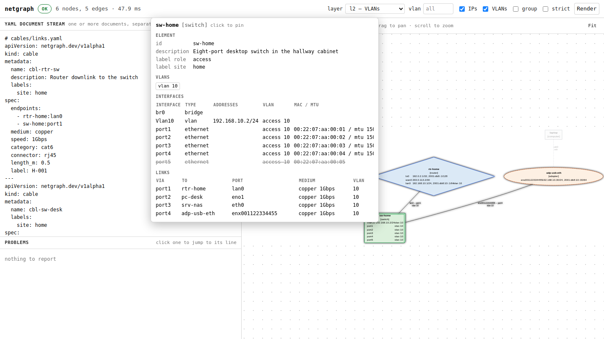

# `netgraph web`

`netgraph web` opens an inventory in the browser and draws it as you edit it,
with an info box on every node and link. It has two faces, and which one you get
is decided by what you point it at:

* **a folder** — an *editing session*. The server holds the loaded tree, the page
  lists its files and the documents in them, and with `--write` the browser can
  change them. This is the one to use for an inventory.
* **anything else** — a file, a pipe, or nothing — a *scratchpad*. One YAML
  document stream, held in the browser, rendered as you type, written nowhere.
  This is the one to use for a snippet or a paste.

## Synopsis

<!-- generated: synopsis web -->
```text
netgraph [GLOBAL OPTIONS] web [OPTIONS] [SOURCE]
```
<!-- /generated -->



<sub>Hovering `sw-home` in [`examples/home-lab`](../../examples/home-lab): every
port, its addresses and VLAN mode, and what each one is cabled to.</sub>

## The editing session

<!-- norun: every one of these starts a server and never exits -->
```bash
netgraph web ./inventory                # read-only: browse the tree and its diagram
netgraph web ./inventory --write        # read-write: save, undo and redo from the page
```

The window is three panes. On the left is the **inventory**: every file the
loader would read, grouped by namespace, with the documents each one declares
listed under it by kind and name. In the middle is the **file being edited** and
the problems found in the tree. On the right is the **diagram**.

The panes are wired to each other, which is the point of the command:

* **Selecting a file opens it**, whole, in the editor.
* **Selecting a node in the diagram reveals the document that declares it** — the
  right file, scrolled and selected at the right line. The shape carries the
  element's address, the address is in the file list against a file and a line,
  and that mapping comes from the same load the diagram was built from.
* **Clicking a problem navigates to its file *and* line**, opening the file if it
  is not the one on screen.
* **A problem with a mechanical repair grows a `fix` button**, which applies it
  as one logged, undoable gesture. Where a rule admits two repairs there are two
  buttons and no default, because choosing between them is not the tool's to
  make. It is the same catalogue `netgraph validate --fix` uses, under the same
  gate: the repair is thrown away unless re-validating shows the finding gone and
  no rule reporting more than it did.
  [Fixing a finding](../validation-rules.md#fixing-a-finding) lists them.

**Every file's state is shown as it is, not as it would be convenient.** A file
you have typed into is `unsaved`. A file that changed on disk while you had
unsaved edits in it is `conflict`, and netgraph will not resolve that for you: it
says so and leaves both versions alone until you decide. A file that was deleted
underneath you says `deleted on disk`.

### The guided tour

The first time you open a session, the page offers a sixty-second tour. Take it
with <kbd>Enter</kbd>, decline it with <kbd>Esc</kbd> — declining is remembered,
and `Ctrl-K` → *Take the guided tour* runs it again whenever you want it.

It creates a device, cables it to one of yours, moves its document to another
file, opens the changes drawer on the YAML all three wrote, and undoes the lot.
The point is the mapping: every shape on the canvas is a document, so a shape
cannot appear without a file appearing, and undoing the gesture brings the bytes
back.

**It never touches your inventory.** Starting the tour copies the tree — only
the documents the loader reads, plus `netgraph.toml` — into a temporary
directory and points the page at a second session over the copy. That session is
always writable, so a read-only `netgraph web DIR` can take the tour too; the
panel names both directories so there is no doubt which one is being written.
Finishing, skipping or closing the tab deletes the copy, and so does stopping
the server.

Any step may be refused — it is the real write path, and it is allowed to say
no. The tour shows the refusal and carries on to the next card.

### Writing

`--write` is off by default, and it is refused unless the server is bound to
loopback — publishing an endpoint that changes your inventory is not something a
flag should let you do by accident. Without it every read works and every write
answers `403`.

With it:

* **Ctrl-S** writes the open file back. The write carries the content hash the
  file was read at; if the file moved underneath, the save is refused and shown
  as a conflict rather than overwriting the other edit. Saving again after that
  overwrites deliberately.
* **Ctrl-Z / Ctrl-Y** undo and redo. The stack lives **on the server**, so it
  survives a page reload and a second tab sees the same history. Each entry is
  the exact inverse the [mutation layer](../editing.md) produced, so an undo
  restores bytes — the comment style, the quoting and the reference spellings of
  every document a rename rewrote.
* **A change that would break the tree is refused**, listing the problems, and
  can then be written anyway. This is the same gate
  [`netgraph edit`](edit.md) applies: an inventory that already fails
  `validate` can still be edited, one that would gain a *new* error cannot
  without saying so.

Every write goes through `netgraph.edit` — the same typed, reversible,
comment-preserving operations [`netgraph edit`](edit.md) applies from the command
line. The server constructs no YAML of its own, so untouched lines are not
rewritten and a diff of an edit shows the edit.

### Reviewing what you changed

The **Changes** button opens a drawer listing every gesture the session made,
newest first. One entry per gesture rather than per operation: deleting a switch
is one line, not the five operations it became. Each carries

* **the YAML hunk it wrote**, as a unified diff with `a/`–`b/` prefixes, so it
  pastes into a patch file without editing;
* **its label**, which reveals the document it changed at its line — the same
  mapping a click on the diagram uses, run from the log instead;
* **Revert**, which puts that one change back.

**A revert is a new change, not a rewind.** It applies the gesture's own inverse
as a fresh edit, which is itself logged and itself undoable, so reverting the
third of ten gestures leaves the other nine alone. When one of those nine
depended on what the third one did, the revert is refused with the reason and
nothing is written — which is the honest outcome, and the one an undo stack
cannot give you.

Opening the drawer also **repaints the canvas as a diff**: added elements green,
removed ones red and dashed but still in place, changed ones amber with a badge
naming the fields that moved, everything untouched faded. The `since` menu
chooses what it is drawn against —

| | |
|---|---|
| `this session started` | the tree as this page first saw it. The default: "what have I done this afternoon" is the question, and neither git nor the undo stack answers it. |
| `git HEAD` | `HEAD` as the inventory root looks in it. Offered only when the root is in a repository, because an option that always fails is not an option. |

It is the same overlay [`netgraph diff`](diff.md) draws, from the same
changeset — the drawer and the diagram are two views of one answer.

**Copy commands** hands the whole session over as a list of
[`netgraph edit`](edit.md) invocations, in the order they happened, for a
pull-request description or somebody else's terminal. The rendering is never
lossy; see [`docs/editing.md`](../editing.md#as-a-script).

### The history timeline

The inventory is a folder of YAML in a repository, so its whole history is
renderable. **History**, above the canvas, opens a scrubber along the bottom of
it, over the commits [`netgraph log`](log.md) lists — and the diagram becomes
the diff each one carries against its parent as you step:

```text
 ▶  ◀◀  ────────────●───────  ▶▶   Now   ×
 e58b3c3a0  Add a lab switch   Scrubber · 2026-08-14   1 device added
```

Oldest on the left. Beside the control is the commit itself — the abbreviated
hash, its subject, its author and date, and the one-line summary of what it did
to the network — because a picture with a hash under it places nothing in time.

| Control | |
|---|---|
| the slider | Any commit in the range. It repaints as it is dragged; ground already covered comes back out of the cache. |
| `◀◀` / `▶▶` | One commit older or newer. `Alt-Left` and `Alt-Right`. |
| `▶` | Play: step forward by itself, about a frame a second, until the newest revision or until one that will not load. `Alt-P`. |
| **Now** | Leave the history and draw the working tree again. `Escape` does the same. |

**Each frame is arranged the way that revision arranged it.** Both sides of the
diff are read out of the commit, [layout document](layout.md) included, so a
diagram that was hand-placed in March is still hand-placed when you scrub back
to March — and one placed since is not retro-fitted onto a picture that never
had it.

The history and the [changes drawer](#reviewing-what-you-changed) are two
overlays on one canvas, so opening either puts the other away. The legend means
the same four things in both.

#### What it will not pretend

* **A revision whose inventory does not load** stops the playback and says which
  revision and why, in the place the summary would have gone. It is not skipped:
  a commit that broke the tree is the one worth stopping on.
* **A revision from before the inventory existed** is an empty network, not an
  error, so the commit that first added the folder reads as the whole network
  arriving — noted as such beside the summary.
* **A repository with more history than the bound** is truncated to the newest,
  and the bar says "the newest 100 of 312 revisions" rather than implying that
  is all there ever was. The bound is `[history] max-revisions` in
  `netgraph.toml`, 100 by default; see [`netgraph log`](log.md#the-bound), where
  an explicit range wider than it is refused outright rather than truncated.
* **A tree that is not in a repository** says so where the commit would be,
  rather than offering a control that does nothing.

#### What it costs

A frame is one inventory read, one changeset and one Graphviz layout — the same
work drawing the tree at all costs, plus the read and the diff. Two things keep
that interactive:

* **Rendered frames are cached by tree hash**, in pairs: the before tree and the
  after tree. Scrubbing back over ground already covered is a dictionary lookup,
  and so is a revert, a cherry-pick or a rebase that lands on a pair of trees
  already drawn.
* **Neighbouring revisions share their loaded state and their parsed files.**
  Stepping reads one revision rather than two, and the [parse
  cache](cache.md) means that read parses the files the commit touched rather
  than the two thousand it did not.

`tools/bench_history.py` measures it. On the 1056-device benchmark tree, where
one plain render of the working tree is about 1.5 s, a step is about 1.5× that
and a frame already drawn comes back in about 13 ms.

### Reconciliation

The session does not own the files. `watchfiles` watches the folder exactly as
[`netgraph watch`](watch.md) does, so an edit made in `$EDITOR`, a `git
checkout`, or a second netgraph process bumps the tree revision — and the page is
**told**, over a server-sent-events stream, the moment it happens. If the watch
cannot start, the command says so rather than leaving a page that is quietly
stale.

The event says *what* moved, which is what makes the page's response
proportionate to the change:

* a save of one file refetches **that file's row**, not the file list;
* a revision that does not change the drawing of the layer on screen **does not
  redraw it** — the page sends the fingerprint of the picture it is showing and
  the server answers "unchanged" rather than running Graphviz. Editing a
  description on a 1056-device tree went from 1.7 s to 185 ms; see
  [`docs/follow-ups.md`](../follow-ups.md) entry 18 for the harness and the
  numbers.

**The stream is an optimisation, and the page works without it.** A proxy that
buffers responses, a browser without `EventSource`, a stream that will not open:
any of them drops the page back to polling `/api/state` once a second, which
replays the very same events out of the server's ring buffer. The indicator above
the file list says which of the two you are on. Nothing is writable through the
stream and no write depends on having read one.

### More than one client

A session is shared — two tabs, or two people on the same machine — and it says
so rather than leaving them to collide:

* every connected page is listed above the file list, with what it is looking at
  and what it is editing in the tooltip;
* what somebody else has **selected** is drawn on the canvas as a faint dashed
  halo, distinct from the highlight your own hover gives;
* a file somebody else has **unsaved edits in** is badged `in use`.

**All of that is advisory.** It blocks nothing: the row still opens, the file
still saves, and presence expires by itself if a tab goes away without saying so.
The only things that can refuse a write are the ones that are checks on the tree
itself — the content hash of a whole-file save and the tree revision of an
operation batch. A soft lock built on a heartbeat would be a way to lock an
inventory by closing a laptop lid.

So the conflict story is unchanged by having company: two clients saving the same
file gives the second a `409` carrying what is really on disk; a save racing an
`$EDITOR` write gives the same; and an undo issued in one tab rewrites the files
and moves the buttons in the other, which is what a server-side history means.

### The API

The page is a client of a small JSON API, and so can anything else be. All of it
is on loopback and none of the write routes exist unless `--write` was given.

| Route | What it answers |
|---|---|
| `GET /api/bindings` | Every command the page has, its section, its keys, what it needs and what it does — plus the element kinds this build knows. Answered in both faces; it is `netgraph.web.bindings`, which is also what the table [below](#the-bindings) is generated from. |
| `GET /api/state` | The tree revision, whether this session writes, the undo/redo depth, and who else is connected. `?since=<id>` adds the events published after that id — the polling client's half of the push channel. `?client=<id>` keeps that client's presence alive. |
| `GET /api/events` | A `text/event-stream` of `tree-changed`, `file-changed`, `history-changed`, `disk-changed`, `presence`, opening with `hello` and beating every 15 s. Resumes from `Last-Event-ID`; a resume point older than the ring buffer opens with `resync`, meaning refetch. |
| `POST /api/presence` | `{"client": …, "selection": [ … ], "editing": [ … ]}` — what this client is looking at and has unsaved edits in; answers with everybody. `{"leaving": true}` drops it at once. Advisory, and the one route here that a read-only session still accepts, because it writes nothing. |
| `GET /api/tree` | Every file, its content hash, its documents, and each document's kind, name, address and line. `?path=a.yaml&path=b.yaml` answers for those files only, with `partial: true` and a `missing` list; `?diagnostics=0` leaves out the findings, which cost a validation of the whole tree either way. |
| `GET /api/graph?view=l2` | The resolved graph as an embeddable SVG, its info-box records, its problems, its stored [geometry](../editing.md) and its [`annotations`](../schema.md#21-diagram-annotations-notes-areas-and-legends) — the same payload `netgraph render -f json` publishes, which is how the canvas knows where a note or a zone is, an arranged drawing having painted the zone into the background with no id on it. `&annotations=0` leaves both the drawing and the payload without them. `graphHash` fingerprints the drawing; passing it back as `?known=` answers `unchanged: true` with no SVG when this revision would draw the same picture, having skipped the layout. |
| `GET /api/file/<path>` | One file's text and the hash a write of it must quote. |
| `PUT /api/file/<path>` | That file back: `{"text": …, "hash": …}`. A stale `hash` is `409`; a new error is `422`, listing them; `"force": true` overrides the second, never the first. |
| `POST /api/ops` | `{"revision": …, "ops": [ … ]}` — a batch of [edit operations](../editing.md), applied atomically. Answers with the applied operations, their inverses, the files changed and the tree's diagnostics. |
| `POST /api/undo`, `POST /api/redo` | Move the server-side history one step. |
| `GET /api/changes` | The session's log — one entry per gesture, with its hunk, the files and addresses it touched, and the `netgraph edit` lines that replay it — plus the whole session as one command list and the baselines this tree can be diffed against. |
| `GET /api/diff?against=session` | The same payload `/api/graph` answers, drawn as a diff, with `diff` holding the marks per node and edge and `diff.changeset` the whole [plan](plan.md). `against=git` compares with `HEAD`. |
| `GET /api/history` | The commits that changed this inventory, newest first, each with its hash, parents, author, date, subject and the hash of the inventory tree at it. `bound` is the ceiling, `total` how many there are and `truncated` whether the list is the newest of more. `?limit=` asks for fewer. |
| `GET /api/frame?rev=<commit>` | One of them, drawn as the diff against its parent: the `/api/diff` payload plus the commit's own facts and the one-line `summary` of what it did. `?known=` works as it does on `/api/graph`. A revision that will not load answers `200` with `status: failed` and the reason — it is a fact about the history, not a bad request. |
| `POST /api/revert` | `{"id": 3, "revision": …}` — put one logged gesture back. |
| `POST /api/fix` | `{"rule": "W138", "message": …, "fix": "prune", "revision": …}` — apply the mechanical repair for one diagnostic, as one gesture. The finding is named by rule and message, not by its place in the list, so a stale list is refused rather than misapplied. `fix` picks between the repairs a rule offers more than one of. |

`<path>` is relative to the inventory root and is checked, not normalised: an
absolute path, a `..`, a component the loader skips and a suffix that is not
YAML are each refused by name. No other request ever becomes a file name.

## Right-clicking

**Right-click the diagram and you get the handful of commands that make sense
where you clicked.** On an element, on a link, and on the paper between them
— three menus, listed below.

Two things it is not. It is not a second set of gestures: every row runs a
command from [the table](#the-bindings) under that command's own id, so the
menu, the palette and the key are three ways to the same one implementation.
And it is not a full list: the palette is one keystroke away with all fifty in
it, and a menu long enough to need reading has stopped being quicker than
typing. `All commands…` is the last row of the canvas menu for exactly that.

What it does add is a target. Right-clicking a shape **focuses it first**, so
`Delete it` deletes the one you pointed at rather than the one the keyboard was
left on, and the menu's heading is the element's address so there is no doubt
which that is. Every row also prints its own shortcut, the same way a palette
row does: use the menu for a week and you will not need it.

**A row that cannot run now is greyed, with the reason on it** — `this session
is read-only; restart it with --write` — rather than missing. `Escape` closes
it, the arrow keys walk it, and <kbd>Shift-F10</kbd> or the menu key opens it on
whatever the diagram has focused, because a menu only a mouse can open is a set
of commands a screen-reader user does not have.

Right-clicking a **bend** on a link still removes that bend, and shows no menu:
the handle is a control of its own, and burying its one gesture two rows deep
would be a loss. Right-clicking anywhere off the canvas is the browser's own
menu, untouched.

<!-- generated: context-menus -->
**Right-clicking a multi-selection**

| Offers | Same as | Needs |
|---|---|---|
| Align left | Align left — *palette only* | `--write` |
| Align centres | Align centres — *palette only* | `--write` |
| Align right | Align right — *palette only* | `--write` |
| Align top | Align top — *palette only* | `--write` |
| Align middles | Align middles — *palette only* | `--write` |
| Align bottom | Align bottom — *palette only* | `--write` |
| Distribute horizontally | Distribute horizontally — *palette only* | `--write` |
| Distribute vertically | Distribute vertically — *palette only* | `--write` |
| Snap to the grid | Snap to the grid — *palette only* | `--write` |
| Copy | Copy the selection — `Ctrl-C` | a folder |
| Cut | Cut the selection — `Ctrl-X` | `--write` |
| Duplicate | Duplicate the selection — `Ctrl-D` | `--write` |
| Set a field on all of them… | Set a field… — `e` | `--write` |
| Remove a field from all of them… | Remove a field… — *palette only* | `--write` |
| Move their documents… | Move to another file… — *palette only* | `--write` |
| Clear the selection | Clear the selection — `Ctrl-Shift-A` | — |
| Delete all of them | Delete the selection — `Delete` | `--write` |

**Right-clicking an element**

| Offers | Same as | Needs |
|---|---|---|
| Inspect it | Open the inspector — `Enter` | a focused element |
| Pin the inspector | Pin the inspector — `Space` | a focused element |
| Cable it to… | Connect this element… — `c` | `--write` |
| Add an interface… | Add an interface… — `i` | `--write` |
| Note about it… | Add a note to the diagram… — `Shift-N` | `--write` |
| Copy | Copy the selection — `Ctrl-C` | a folder |
| Cut | Cut the selection — `Ctrl-X` | `--write` |
| Duplicate | Duplicate the selection — `Ctrl-D` | `--write` |
| Rename it… | Rename the focused element… — `F2` | `--write` |
| Change how it looks… | Restyle the selection — *palette only* | `--write` |
| Set a field… | Set a field… — `e` | `--write` |
| Remove a field… | Remove a field… — *palette only* | `--write` |
| Move its document… | Move to another file… — *palette only* | `--write` |
| Delete it | Delete the selection — `Delete` | `--write` |

**Right-clicking a link**

| Offers | Same as | Needs |
|---|---|---|
| Inspect it | Open the inspector — `Enter` | a focused element |
| Add a bend | Add a bend to the focused link — `b` | `--write` |
| Straighten it | Straighten the focused link — `Shift-B` | `--write` |
| Route it… | Change how the link is routed… — `r` | `--write` |
| Pin the computed route | Pin the route the renderer worked out — `Shift-R` | `--write` |
| Put the label back on the line | Put the link's label back on the line — *palette only* | `--write` |
| Note about it… | Add a note to the diagram… — `Shift-N` | `--write` |
| Change how it looks… | Restyle the selection — *palette only* | `--write` |
| Set a field… | Set a field… — `e` | `--write` |
| Disconnect it | Delete the selection — `Delete` | `--write` |

**Right-clicking a note, an area or a legend**

| Offers | Same as | Needs |
|---|---|---|
| Edit the text… | Edit the note's text… — `Shift-E` | `--write` |
| Delete it | Delete the selection — `Delete` | `--write` |

**Right-clicking the canvas**

| Offers | Same as | Needs |
|---|---|---|
| New ▸ *(one row per element kind)* | Create an element… — `n` | `--write` |
| New note | Add a note to the diagram… — `Shift-N` | `--write` |
| Paste here | Paste — `Ctrl-V` | `--write` |
| Show another layer… | Switch layer… — *palette only* | — |
| Fit the diagram | Fit the diagram — `0` | — |
| Undo | Undo — `Ctrl-Z` | `--write` |
| Redo | Redo — `Ctrl-Shift-Z` | `--write` |
| Show what changed | Changes drawer — `Ctrl-B` | a folder |
| All commands… | Command palette — `Ctrl-K` | — |
<!-- /generated -->

`New ▸` opens one row per element kind, and picking one opens the create form
with that answer already filled in — the same form `n` opens, writing the same
document through the same [`netgraph edit create`](edit.md).

## The keyboard

**Everything this page does is reachable without a pointer**, and the page says
so out loud rather than making you find out. There are three ways in, and they
are three views of one table:

* **`Ctrl-K` — the command palette.** Every command below, fuzzy-matched by name,
  plus everything the page can *go to*: every element address in the diagram and
  every file path in the inventory. Each row prints its own shortcut, so the
  palette is also how the bindings are learnt. A command that cannot run now is
  shown greyed with the reason — "this session is read-only; restart it with
  `--write`" — rather than quietly missing.
* **`?` — the shortcut sheet.** The table below, in a dialog.
* **the keys themselves.**

A fourth, for the pointer: [right-clicking the diagram](#right-clicking) offers
the few of these that fit what is under the cursor, each row printing the chord
that also runs it.

A chord written `Ctrl-…` means the platform's command modifier: ⌘ on a Mac. A
single letter is a *canvas* gesture and fires only while the diagram has focus —
`n` creates a device there and types an `n` in the YAML pane, which is the
distinction the **Where** column makes.

### Driving the diagram

`Tab` reaches the canvas like any other control; the diagram is one stop on the
page's tab order and never a trap. From there the arrow keys walk it, preferring
the elements the focused one is **linked to**, so a path is followed rather than
a grid swept. `Enter` opens the inspector — and, in a session, the document that
declares the element, at its line. `n`, `c` and `Delete` are the create, connect
and delete gestures; each opens a small prompt whose element field is already
filled in with whatever is focused, so the same command works from the palette
with nothing focused at all.

Two rings, deliberately different: **focus** is a solid violet halo — where the
keyboard is — and **selection** is a long dash, with somebody else's selection a
short one. Three patterns, not three shades, so they are told apart without
colour.

### Selecting several things

Most of the editor acts on a **selection**, and a selection is a set:

| Gesture | What it does |
|---|---|
| drag on the paper | A rubber band. Everything it encloses is selected; hold `Shift` to add to what was already there rather than replace it. A drag that starts *on* a shape still pans. |
| `Shift`- or `Ctrl`-click | Adds one element, or takes it back out. Works on the outline entries too. |
| `Ctrl-A` | Everything the current view draws — including whatever is culled off screen. Only on the canvas: `Ctrl-A` in the YAML pane is still the text. |
| `Shift`-arrow | Extends along the same neighbour search the arrow keys use, so a trunk and everything hanging off it is collected without a pointer. |
| `Escape` | Clears it, before it closes anything else. |

The selection is held as **element addresses**, not as shapes, which is what
lets it survive a redraw — a save, an undo, somebody else's edit — and lets a
culled element half a screen away stay in it. The ring is drawn for the ones on
screen; the count is on the diagram outline, where a screen reader hears *"8
elements, 3 links, 2 selected"* and each selected entry as pressed.

With more than one thing selected, the gestures that can mean a set act on all
of it, as **one change**:

* **Delete** asks once — listing what goes, and the cables that will dangle as a
  result — and writes the lot as a single entry in the undo stack. One `Ctrl-Z`
  puts all of it back.
* **Set a field**, **Remove a field** and **Move to another file** apply to
  every selected element in one batch, so twelve switches gain `spec.site` in
  one validated, conflict-checked write.
* **Align**, **distribute** and **snap to grid** appear, from the palette or by
  right-clicking inside the selection. Each writes one reviewable diff into the
  `kind: layout` documents that hold the arrangement — see
  [`docs/editing.md`](../editing.md#arranging-a-selection) — and the grid pitch
  is the inventory's `[editor] grid`.

Right-clicking inside a multi-selection opens the selection's own menu rather
than the element's: the subject is the set, and "Rename it…" on eleven shapes
would have to mean whichever one the pointer happened to be over.

### A thousand devices

Above four hundred elements the canvas stops drawing all of them at once. Two
things happen, and both are visible:

**Only what is on screen is drawn.** Everything more than half a screen outside
the viewport keeps its place in the document and loses its contents until you
pan back to it. The status line says so — *drawing 140 of 2106 in view (pan, or
Ctrl-K to find)* — because a canvas that is quietly missing things is worse than
a slow one. Nothing about *reaching* an element changes: the arrow keys, the
outline, the command palette and find-in-diagram all work from the records
rather than from the drawing, so selecting something on the far side of the
diagram brings it back and pans to it.

**Zoomed out, the labels come off.** Below the scale at which a device name is
a smudge, the names and the icons are dropped and each namespace grows a dashed
frame with its name and how many elements are in it. Zoom back in and they
return. The zoom range is the drawing's own, not a fixed multiple, so a label on
a thousand-device diagram can always be reached.

The first layout of an inventory that size is a real Graphviz run and takes a
second or two; the status line counts while it happens rather than sitting
still. If a redraw after dragging a node feels slow, it is: a diagram with
*some* positions stored has to be laid out twice, and
[`netgraph layout --write`](layout.md) places the rest and takes the redraw to a
fraction of it. The measured ceilings are in
[`docs/follow-ups.md`](../follow-ups.md) entry 20.

### Routing a cable

A link is geometry as much as a node is
([`docs/schema.md` §18](../schema.md#18-layout-diagram-geometry)), and once the
view is arranged it can be routed here. Click a link to select it; **double-click**
the line to drop a bend where you clicked; drag a bend to move it; drag the
hollow **midpoint handle** to insert a bend and place it in one motion;
**right-click** a bend to remove it. A label the inventory has already pinned
gets a handle of its own, which slides it along the route and lifts it off.

Each of those is also a command, because a bend that can only be placed with a
mouse is a bend somebody working from the keyboard cannot place at all: `b` adds
one half way along the selected link, `Shift-B` straightens it, `r` sets its
routing style — spline, orthogonal or straight, on this link alone — and the
palette puts a moved label back on the line. On a view that is not arranged they
refuse with the fix, `netgraph layout --write`, rather than doing nothing: a
diagram Graphviz is still routing has nowhere to keep a bend.

Nothing here is a browser-side model of the arrangement. Letting go of a handle
posts one `set-link-geometry` operation
([`docs/editing.md`](../editing.md#the-operations)), the server rewrites the
`kind: layout` document through the same comment-preserving path
[`netgraph layout`](layout.md) uses, and the canvas repaints from the render
that follows — so what you see here is what `netgraph render` draws, and the
gesture is one entry in the changes drawer with a YAML hunk under it. The line
*under the cursor* is drawn by a port of netgraph's own router, which
`tests/test_browser.py` runs against the Python it mirrors on every CI run, so a
drag cannot land somewhere the render would not.

### Writing on the diagram

The commentary of
[`docs/schema.md` §21](../schema.md#21-diagram-annotations-notes-areas-and-legends)
— a callout, a zone, a key — is edited here the way a cable's route is.
**`Shift-N`** drops a note at the pointer and opens it for typing; right-clicking
an element or a link and choosing **Note about it…** anchors the note to that
instead, so it follows the device when the diagram is laid out again. A note is
retyped by **double-clicking** it, or with `Shift-E` on a selected one:
`Ctrl-Enter` or clicking away writes it, `Escape` leaves it alone. Dragging a
note moves it, its corner resizes it, and a zone pinned to a rectangle is dragged
by its outline and resized by its corners. `Delete` removes whichever is
selected. **`Alt-N`** hides the lot, which changes no file: commentary is never
topology, so it is a way of looking at the diagram rather than a way of changing
it.

A zone drawn round its *members* has no box to move — it is wherever those
devices are — so dragging it is refused with that sentence rather than quietly
turned into a rectangle. Everything else lands as one `create-annotation`,
`set-annotation` or `delete-annotation` batch through `/api/ops`, which is one
entry in the changes drawer and one `Ctrl-Z`; the rules are in
[`docs/editing.md`](../editing.md#annotating-a-diagram).

### Without a screen

The rendered SVG is inert by default: Graphviz emits shapes, not semantics. This
page adds them from the same records the info box is built from, so there is one
description of an element rather than two that drift:

* every node and link carries a role and an `aria-label` — *"sw-home, switch, 8
  interfaces, linked to rtr-edge on eth0"*;
* the canvas is an `application` that says which element is current, so arrowing
  around it is announced;
* **`Alt-4` opens the outline** — the whole view as a list, one line per element,
  which is both the screen-reader fallback and the fastest way to find something
  by name. It is off screen until focused and a real panel once it is;
* every applied, refused and reverted gesture is announced in a live region,
  once. A refusal interrupts; everything else is polite.

The interface follows `prefers-color-scheme` with a palette per scheme — every
colour clears 4.5:1 against its own background, which a single palette used on
both cannot — and honours `prefers-reduced-motion`. Where a colour carries
meaning it is never alone: the diff legend prints `+`, `~` and `−`, the same
sigils the diagram draws, and the three diff line styles differ as well as the
three hues.

`tests/test_browser.py` runs axe-core over the page on every CI run and fails on
a new WCAG 2.1 AA violation, and drives one end-to-end test — create a device,
cable it, undo both — without dispatching a single mouse event.

### The bindings

<!-- generated: keybindings -->
**Everywhere**

| Keys | Command | Where | Needs | What it does |
|---|---|---|---|---|
| `Ctrl-K` / `Ctrl-Shift-P` | Command palette | anywhere | — | Every command on this page, searched by name — and every element address and file path in the inventory, so one field is also 'go to'. |
| `?` / `F1` | Keyboard shortcuts | anywhere | — | This table, rendered from the bindings the page actually registered. |
| `ContextMenu` / `Shift-F10` | Open the context menu | the diagram | — | What the pointer's right-click offers, on whatever the diagram has focused — the element, the link, or the canvas itself when nothing is. |
| *palette only* | Take the guided tour | anywhere | a folder | Sixty seconds that create a device, cable it up, move its document, show the YAML that changed and undo the lot — on a throwaway copy of this inventory, so nothing here is written to your files. |
| `Escape` | Close what is open | anywhere | — | The palette, the reference, a prompt, the changes drawer, the inspector — in that order. |
| `Alt-1` | Focus the inventory list | anywhere | a folder | The file list. Arrow keys move down it; Enter opens a file. |
| `Alt-2` | Focus the YAML pane | anywhere | — | The text of the open document. Escape leaves it again. |
| `Alt-3` | Focus the diagram | anywhere | — | Puts a focus ring on an element and turns on the gestures below. |
| `Alt-4` | Focus the diagram outline | anywhere | — | The diagram as a list a screen reader can read straight through: one line per element, with what it is linked to. |
| `Ctrl-Enter` | Render now | anywhere | — | Draw the diagram again without waiting for the editor to settle. |
| `Ctrl-Shift-Enter` | Validate the inventory | anywhere | — | Re-run the checks and move focus to the problems list. |

**Moving around**

| Keys | Command | Where | Needs | What it does |
|---|---|---|---|---|
| `ArrowRight` / `ArrowLeft` / `ArrowUp` / `ArrowDown` | Move to the adjacent element | the diagram | — | Steps to the nearest element in that direction, preferring one this element is linked to — so a whole path can be walked with one hand. |
| `l` / `Shift-L` | Cycle this element's links | the diagram | — | Focuses each cable or tunnel that terminates here in turn, so a link can be inspected or removed without a pointer. Tab is left alone: the diagram is one stop on the page's tab order, never a trap. |
| `Home` | First element | the diagram | — | The first element of the outline, which is the diagram in reading order. |
| `End` | Last element | the diagram | — | The last element of the outline. |
| `Enter` | Open the inspector | the diagram | a focused element | Everything known about the focused element, and — in a session — the document that declares it, opened at its line. |
| `Space` | Pin the inspector | the diagram | a focused element | Keeps the inspector up, and tells the other tabs what this one is looking at. |
| `Ctrl-G` | Go to element… | anywhere | — | The palette, opened over element addresses alone. |
| `Ctrl-O` | Open file… | anywhere | a folder | The palette, opened over the inventory's file paths alone. |
| `Ctrl-A` | Select everything in this view | the diagram | — | Every element and link the diagram is drawing, including the ones culled off screen. The canvas only — Ctrl-A in the YAML pane is still the text. |
| `Ctrl-Shift-A` | Clear the selection | anywhere | — | Escape does this too, before it closes anything else. |
| `Shift-ArrowRight` / `Shift-ArrowLeft` / `Shift-ArrowUp` / `Shift-ArrowDown` | Extend the selection | the diagram | — | Steps the way the arrow keys do — preferring an element this one is linked to — and adds what it lands on, so a trunk and everything hanging off it can be collected without a pointer. |

**Editing the inventory**

| Keys | Command | Where | Needs | What it does |
|---|---|---|---|---|
| `n` | Create an element… | the diagram | `--write` | Asks for a kind and a name, and writes the document. 'netgraph edit create'. |
| `c` | Connect this element… | the diagram | `--write` | Cables the focused element to another, port to port. 'netgraph edit connect'. |
| `Delete` / `Backspace` | Delete the selection | the diagram | `--write` | Removes everything selected, or the focused element when nothing is. Asks once, listing what goes and the cables that dangle as a result, and writes it as one change. 'netgraph edit delete' / 'disconnect'. |
| `Ctrl-C` | Copy the selection | the diagram | a folder | Puts the selected elements on the system clipboard as JSON — the documents themselves, plus any cable whose two ends are both selected. Paste it into another netgraph window, or into a text editor to read it. 'netgraph edit copy'. |
| `Ctrl-X` | Cut the selection | the diagram | `--write` | Copy, and then delete what was copied — as one change, so one Ctrl-Z puts the documents back. Asks first, listing what goes. |
| `Ctrl-V` | Paste | the diagram | `--write` | Writes the clipboard fragment into this inventory: new documents, with free names, the internal cables rewired to the copies, and positions offset from the originals — or dropped where you last right-clicked. A fragment from another inventory pastes the same way. |
| `Ctrl-D` | Duplicate the selection | the diagram | `--write` | Copy and paste in one keystroke, without touching the system clipboard: each selected element gets a sibling called 'sw1-copy' beside it. 'netgraph edit duplicate'. |
| `F2` | Rename the focused element… | the diagram | `--write` | Renames it and every reference to it. 'netgraph edit rename'. |
| `e` | Set a field… | the diagram | `--write` | A dotted path and a YAML value, on every selected element at once — or on the focused one when nothing is selected. 'netgraph edit set'. |
| *palette only* | Remove a field… | anywhere | `--write` | 'netgraph edit unset', across the whole selection as one change. |
| *palette only* | Move to another file… | anywhere | `--write` | Moves the selected documents into a different file, together. 'netgraph edit move'. |
| *palette only* | Disconnect a cable… | anywhere | `--write` | Removes a cable, leaving both devices. 'netgraph edit disconnect'. |
| `b` | Add a bend to the focused link | the diagram | `--write` | Drops a waypoint half way along the link, which the route then passes through. Double-clicking the line does the same at the point clicked. |
| `Shift-B` | Straighten the focused link | the diagram | `--write` | Clears every bend, leaving the link to run directly between its two devices. The routing style and the label position are kept. |
| `r` | Change how the link is routed… | the diagram | `--write` | Spline, orthogonal or straight, on this link alone. Clearing it takes the view's default back. Honoured by 'netgraph render' as well as here. |
| `Shift-R` | Pin the route the renderer worked out | the diagram | `--write` | Writes the bends netgraph computed to keep this link clear of the boxes it passes into the layout document, so they become bends you placed: they stop being recomputed, they get a grab handle each, and moving a device no longer moves them. Refuses on a link that needed no detour, since there would be nothing to pin. |
| *palette only* | Put the link's label back on the line | anywhere | `--write` | Undoes a nudged label, leaving it half way along the route where the renderer puts one nobody has moved. |
| `Shift-N` | Add a note to the diagram… | the diagram | `--write` | Drops a note where the pointer is — or in the middle of the view when the keyboard asks — and opens it for typing. Right-clicking an element or a link anchors the note to it instead, so it follows what it is about. 'netgraph edit create-annotation'. |
| `Shift-E` | Edit the note's text… | the diagram | `--write` | A text box over the note itself, in the markdown subset §21 defines. Ctrl-Enter or clicking away writes 'spec.text'; Escape abandons it and writes nothing. Double-clicking the note does the same. |
| `i` | Add an interface… | the diagram | `--write` | 'netgraph edit add-interface'. |
| *palette only* | Remove an interface… | anywhere | `--write` | 'netgraph edit remove-interface'. |
| `Ctrl-Shift-Y` | Style inspector | anywhere | a folder | How the selection is drawn (§22), which layer each value came from, and the controls to change it. A change is written to spec.style, so the picture and the YAML stay one thing. |
| *palette only* | Restyle the selection | anywhere | `--write` | Open the style inspector on what is selected. |

**Arranging the diagram**

| Keys | Command | Where | Needs | What it does |
|---|---|---|---|---|
| *palette only* | Align left | anywhere | `--write` | Every selected element onto the leftmost one's left edge. |
| *palette only* | Align centres | anywhere | `--write` | Onto the vertical axis half way across the selection. |
| *palette only* | Align right | anywhere | `--write` | Onto the rightmost one's right edge. |
| *palette only* | Align top | anywhere | `--write` | Onto the topmost one's top edge. |
| *palette only* | Align middles | anywhere | `--write` | Onto the horizontal axis half way down the selection. |
| *palette only* | Align bottom | anywhere | `--write` | Onto the bottommost one's bottom edge. |
| *palette only* | Distribute horizontally | anywhere | `--write` | Equal gaps between the boxes, left to right, with the two outermost left where they are. Needs three. |
| *palette only* | Distribute vertically | anywhere | `--write` | The same, top to bottom. |
| *palette only* | Snap to the grid | anywhere | `--write` | Rounds each selected element's position to the pitch this inventory sets in 'netgraph.toml' ([editor] grid, 20 points by default). |

**The view**

| Keys | Command | Where | Needs | What it does |
|---|---|---|---|---|
| *palette only* | Switch layer… | anywhere | — | Physical, l1, l2, l3, overlay, routing, rack, power, identity. |
| `]` | Next layer | anywhere | — | The next entry of the layer menu. |
| `[` | Previous layer | anywhere | — | The previous entry of the layer menu. |
| `Alt-I` | Toggle IP addresses | anywhere | — | Whether the picture prints addresses. The inspector shows them either way. |
| `Alt-V` | Toggle VLANs | anywhere | — | Whether the picture prints VLAN membership. |
| `Alt-G` | Toggle namespace grouping | anywhere | — | Collapse each namespace into one box. |
| `Alt-N` | Toggle annotations | anywhere | — | Whether the notes, areas and legends of §21 are drawn. They are commentary, never topology, so hiding them changes nothing the tool concludes — only how much of the picture is somebody's explanation. |
| `Alt-S` | Toggle strict | anywhere | — | Report warnings as errors. |
| *palette only* | Filter by VLAN… | anywhere | — | Keep only elements participating in the VLANs given. |
| `Alt-F` | Failure mode | anywhere | a folder | Click an element and everything it would isolate from the gateways greys out; the status line names the count. Reads only — nothing is written, and Escape or the same key puts the diagram back. |
| `0` | Fit the diagram | anywhere | — | Undo the panning and zooming. |
| `Plus` / `=` | Zoom in | anywhere | — | Around the middle of the canvas, so nothing jumps off screen. |
| `Minus` | Zoom out | anywhere | — | Around the middle of the canvas. |

**Files and history**

| Keys | Command | Where | Needs | What it does |
|---|---|---|---|---|
| `Ctrl-S` | Save the open file | anywhere | `--write` | Writes it back, stating the hash it was opened at. |
| `Ctrl-Z` | Undo | anywhere | `--write` | The session's stack, not the browser's: it puts files back on disk. |
| `Ctrl-Shift-Z` / `Ctrl-Y` | Redo | anywhere | `--write` | Applies the last undone change again. |
| `Ctrl-B` | Changes drawer | anywhere | a folder | This session's changes, and the diagram repainted as the diff they add up to. |
| *palette only* | Copy the equivalent commands | anywhere | a folder | The session as a 'netgraph edit' script somebody else can review or run. |
| `Ctrl-Shift-H` | History timeline | anywhere | a folder | A scrubber over the commits that changed this inventory. The diagram becomes the diff the selected commit carries against its parent, arranged as that revision arranged it. |
| `Alt-ArrowLeft` | Older revision | anywhere | a folder | One commit back along the timeline. Stops the playback if it is running. |
| `Alt-ArrowRight` | Newer revision | anywhere | a folder | One commit forward along the timeline. |
| `Alt-P` | Play the history | anywhere | a folder | Step through the range by itself, a frame at a time, until the newest revision or until one that will not load. |
<!-- /generated -->

## The scratchpad

<!-- norun: every one of these starts a server and never exits -->
```bash
netgraph web                                  # opens on the netgraph init example
netgraph web devices/sw-office.yaml           # seeded from one file
kubectl get cm topology -o jsonpath={..yaml} | netgraph web   # or from a pipe
```

The left pane holds a document stream — one or more documents separated by `---`
— and re-renders about half a second after you stop typing. **Nothing is
written.** The seed is read once, at startup; after that the stream lives in the
browser and every pass happens in memory, so the command cannot damage the file
it was seeded from and equally will not save your work: copy the text out before
you close the tab.

A stream has no folders and therefore **no namespaces**, and no file to write
back to. That is why `--write` is refused here and why a folder opens a session
instead.

## Both faces

**Hovering a node or a link opens an info box** holding what the diagram has no
room for: every interface with its type, MAC, MTU, addresses and VLAN mode; every
link that terminates on the element, what it runs to and over which port; and, at
layer 3, the prefix a subnet node stands for and who is addressed in it.
Everything it shows is the same data `netgraph render -f json` exports — the
records *are* that export — so the two cannot drift apart, and they are the same
records a committed SVG carries as tooltips
([`docs/rendering.md`](../rendering.md)). The element under the pointer and
everything it touches are lifted out of the diagram while the box is open; click
to pin the box, click again or press `Esc` to let go.

Beyond that: the layer, the VLAN filter and the display toggles are in the header
and apply on the next render; the canvas pans with a drag and zooms with the
wheel; and the splitter between the panes moves.

**Broken text still draws.** `netgraph render` refuses an inventory with errors
unless `--force`, because a diagram that disagrees with the files misinforms
whoever is shown it. Here the diagram *is* the feedback and text being edited is
wrong most of the time, so every problem is listed with its file and line and
whatever resolved is drawn anyway.

`netgraph.toml` decides how this machine *draws*: the `[render]` table and
`--profile` of the inventory named by `-i` — the current directory by default —
supply the settings this command has, `--icons` above all. A session also reads
the `[validate]` table of the folder it has open, so the problems it lists are
the ones [`netgraph validate`](validate.md) would list in that tree; a stream has
no folder of its own to look in and uses the built-in defaults plus the `strict`
toggle in the header.

`--icons` is chosen on the command line rather than in the browser for the same
reason `--write` is: it may name a directory on this machine, and a page has no
business reading one.

## The server

The same restrictions apply as to the [`watch` preview](watch.md) — loopback by
default, so publishing the interface with `--host` is an explicit act and is
warned about; a fixed set of routes; no request path ever turned into a file name;
a `Host` header check that keeps a loopback bind from being reached through a
rebound DNS name — plus three of its own: a request body is capped at 1 MB, the
SVG is parsed and stripped of anything that could execute or navigate before it is
put into the page, and no write route exists at all without `--write` on a
loopback bind. It is a development server: do not put it on a hostile network.

### The event stream and presence, against the same threat model

Both are new surface, and both are held to the rules above rather than excused
from them.

* **Same bind, same `Host` check.** `/api/events` and `/api/presence` are
  ordinary routes on the same handler, so a request that reached a loopback bind
  under another name is refused with `421` before either is entered. A page on a
  hostile origin therefore cannot open the stream and read your topology out of
  it — which matters more here than elsewhere, because a stream keeps delivering.
  `connect-src 'self'` in the [Content-Security-Policy](../architecture.md) says
  the same thing from the other side.
* **The stream is read-only, and so is presence.** Nothing about the inventory
  can be changed through either. `/api/presence` writes to an in-memory list and
  is the one route a read-only session still accepts, because "who else is
  looking" is useful to two people browsing and touches no file. On a bind you
  published with `--host`, anyone who can reach it can read the stream and add
  themselves to that list — which is a nuisance rather than a compromise, and
  one more reason publishing is an explicit act.
* **A client id is a name, never a permission.** Ids are issued by the server and
  a request that invents one gets a fresh identity rather than somebody else's
  entry. The id travels with a write only so the page can recognise its own
  change in the events and skip a reload; nothing is authorised by it, and a
  request that claims another client's id can do nothing this one could not.
* **Neither is unbounded.** At most 32 streams and 64 clients per session, at
  most 64 selected addresses and dirty paths per client, a 256-event ring buffer,
  and a subscription that falls 64 events behind is resynchronised rather than
  buffered. A page in a reload loop cannot make the process grow, and a stalled
  tab cannot make it grow on that tab's behalf.
* **Presence expires.** Entries go after 45 s of silence. It is deliberately not
  a lock: a lock that a heartbeat can hold is a way to lock an inventory by
  closing a laptop lid, and everything that can actually refuse a write — the
  content hash, the tree revision — is a check on the tree rather than on a
  claim.
* **Nothing new becomes a file name.** `?path=` on `/api/tree` goes through the
  same check as `/api/file/<path>`: relative, below the root, no component the
  loader skips, YAML suffix. It is a second door into the same room and it has
  the same lock.
* **Nothing becomes a git *option*.** `?rev=` on `/api/frame` reaches a `git`
  argument list, and `git log --output=<file>` writes a file while
  `--upload-pack=<cmd>` runs a program. A revision that begins with `-` is
  refused by name before any git process starts, on every path that takes one —
  the route, the timeline, `netgraph log` and `netgraph diff --from` alike.

The default port is 8081, one above the `watch` preview's, so a watch run and an
editing session can be open at the same time. `--port 0` lets the operating system
choose one instead. `--open` — on by default — points the default browser at the
page once the server is listening; `--no-open` prints the URL and leaves the
browser alone, which is what you want over SSH.

## Arguments

<!-- generated: arguments web -->
| Argument | Required | Count | Default |
|---|---|---|---|
| `[SOURCE]` | no | 1 | — |
<!-- /generated -->

## Options

<!-- generated: options web -->
| Flag | Value | Default | Meaning |
|---|---|---|---|
| `--host` | `ADDRESS` | `127.0.0.1` | Address to bind. The default keeps the interface on this machine; an inventory describes internal topology, so publishing it is an explicit act. |
| `--port` | `INTEGER, 0-65535` | `8081` | Port to bind. 0 lets the operating system choose one. |
| `--open`, `--no-open` | — | `--open` | Open the interface in the default browser once it is listening. |
| `--icons` | `THEME\|DIR` | — | Draw each element as an icon instead of a plain shape. Built in: cisco, none. Chosen here rather than in the browser, because it names a directory on this machine. |
| `--theme` | `NAME\|PATH` | — | Apply a stylesheet to the diagram (§22). The style inspector shows the resolved appearance and which layer each value came from. Built in: blueprint, mono, none. Chosen here rather than in the browser, because it names a file on this machine. |
| `--write`, `--read-only` | — | --read-only | Let the browser change the inventory. Only for a SOURCE folder, only on a loopback bind, and never by default: an editor that can write is a decision. |
| `--profile` | `NAME` | — | Apply the [profile.NAME] block of netgraph.toml on top of its [render] table. Explicit flags still win over both. |
| `--show-config` | — | off | Print the settings this invocation resolves to, and where each one came from, then exit without doing any work. |
<!-- /generated -->

## Exit codes

The interface is ended by Ctrl-C, which is how the command is meant to finish.
Text that does not parse is reported in the page, not by the process.

| Code | Meaning |
|---|---|
| 0 | The server ran and was stopped with Ctrl-C. |
| 2 | Usage error, an unusable `netgraph.toml`, or `--write` where it cannot be given. |
| 3 | A `SOURCE` folder could not be read. |
| 6 | The address could not be bound — usually something else on port 8081. |

## See also

* [`netgraph edit`](edit.md) — the same operations from the command line, and the
  layer every write in the browser goes through.
* [`netgraph diff`](diff.md) — the same overlay from the command line, over two
  folders, a git ref or a saved plan.
* [`netgraph watch`](watch.md) — the same live diagram without an editor, for a
  second screen.
* [`docs/editing.md`](../editing.md) — what an operation is, what an inverse
  promises, and how geometry is stored.
* [`docs/rendering.md`](../rendering.md) — the layers and display options the
  header exposes, and the tooltips the info box shares its records with.
* [`docs/inventory-layout.md`](../inventory-layout.md) — why a folder tree means
  namespaces and a stream does not.
* [`docs/validation.md`](../validation.md) — the problems the middle pane lists.
* [`docs/testing.md`](../testing.md#the-browser-layer) — the headless-browser
  suite that drives this page, and how to run it.
