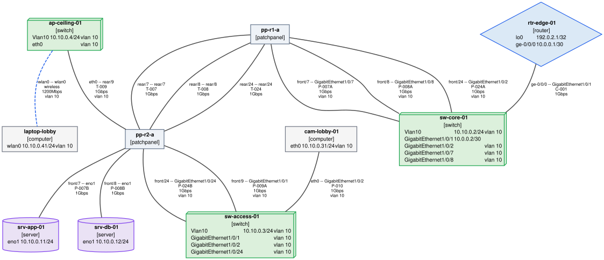
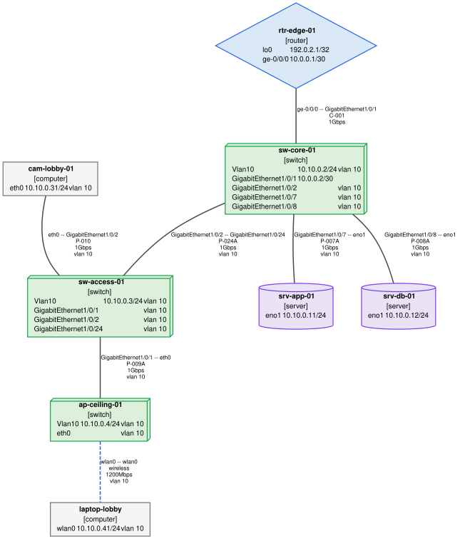
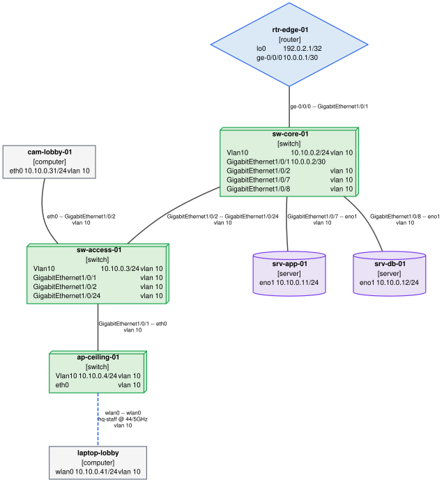
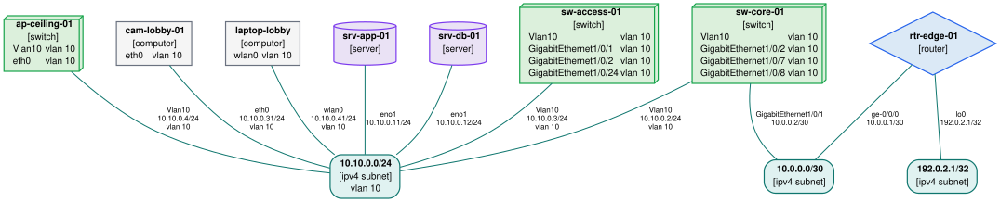
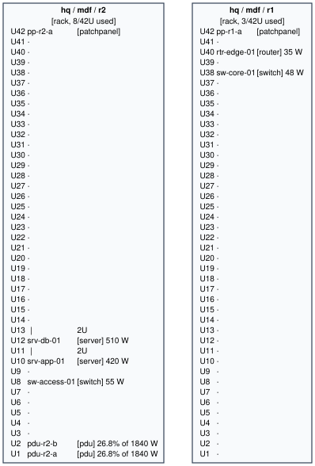
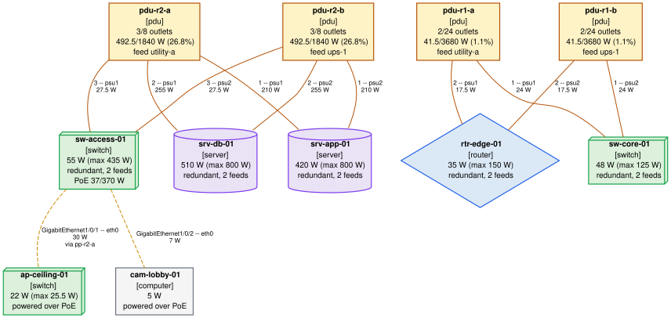

# patch-room — as-built network documentation

28 element(s) across 1 site page(s), covering the whole inventory.

| Fact | Value |
|:---|:---|
| Inventory | `patch-room` |
| Scope | the whole inventory |
| Generated | 2026-07-30T00:00:00Z |
| netgraph | 0.1.0 |
| Inventory revision | not under version control |

## Sites

One page per site. A site is a namespace; see --group-depth.

**Site pages**

| SITE | ELEMENTS | CABLES | TUNNELS | SUBNETS |
|:---|---:|---:|---:|---:|
| [(inventory root)](sites/root.md) | 14 | 14 | 0 | 3 |

## Diagrams

One drawing per layer, from the same inventory as the tables below.

**Cabling, patch panels included** — 10 node(s), 14 link(s)

**Physical topology** — 8 node(s), 7 link(s)

**VLANs** — 8 node(s), 7 link(s)

**IP subnets** — 11 node(s), 10 link(s)

**Rack elevations** — 2 node(s), 0 link(s)

**Power: PDUs and feeds** — 11 node(s), 12 link(s)

## Validation findings

**Findings**

_The validator reports nothing about this inventory._

These are the findings 'netgraph validate' reports for this inventory. A report is only as authoritative as the inventory behind it, so they are documented here rather than left out.

## Every element

One row per element, linked to its page.

**Elements**

| NAME | KIND | PORTS | ADDRESS | VLANS |
|:---|:---|---:|:---|:---|
| [hosts/ap-ceiling-01](devices/hosts_ap-ceiling-01.md) | switch | 4 | 10.10.0.4/24 | 10 |
| [hosts/cam-lobby-01](devices/hosts_cam-lobby-01.md) | computer | 1 | 10.10.0.31/24 | 10 |
| [hosts/laptop-lobby](devices/hosts_laptop-lobby.md) | computer | 1 | 10.10.0.41/24 | 10 |
| [hosts/srv-app-01](devices/hosts_srv-app-01.md) | server | 2 | 10.10.0.11/24 | - |
| [hosts/srv-db-01](devices/hosts_srv-db-01.md) | server | 2 | 10.10.0.12/24 | - |
| [network/rtr-edge-01](devices/network_rtr-edge-01.md) | router | 2 | 192.0.2.1/32 | - |
| [network/sw-access-01](devices/network_sw-access-01.md) | switch | 5 | 10.10.0.3/24 | 10 |
| [network/sw-core-01](devices/network_sw-core-01.md) | switch | 6 | 10.10.0.2/24 | 10 |
| [panels/pp-r1-a](devices/panels_pp-r1-a.md) | patchpanel | 48 | - | 10 |
| [panels/pp-r2-a](devices/panels_pp-r2-a.md) | patchpanel | 48 | - | 10 |
| [power/pdu-r1-a](devices/power_pdu-r1-a.md) | pdu | 0 | - | - |
| [power/pdu-r1-b](devices/power_pdu-r1-b.md) | pdu | 0 | - | - |
| [power/pdu-r2-a](devices/power_pdu-r2-a.md) | pdu | 0 | - | - |
| [power/pdu-r2-b](devices/power_pdu-r2-b.md) | pdu | 0 | - | - |

PORTS counts declared interfaces; ADDRESS is the address that places the element on the network, of however many it has.

## Address plan

Every prefix an address sits in, and how full it is.

**Subnets**

| PREFIX | IP | VLANS | HOSTS | USED | FREE | UTIL | DEVICES |
|:---|---:|:---|---:|---:|---:|---:|---:|
| 10.0.0.0/30 | 4 | - | 2 | 2 | 0 | 100.0% | 2 |
| 10.10.0.0/24 | 4 | 10 | 254 | 7 | 247 | 2.8% | 7 |
| 192.0.2.1/32 | 4 | - | 1 | 1 | 0 | 100.0% | 1 |

HOSTS is the usable capacity of the prefix, USED the distinct addresses declared in it. Loopback and link-local prefixes are left out: they are scoped to one host or one link and say nothing about the plan.

## VLANs

Every VLAN, the prefixes carried in it and the elements that are in it.

**VLANs**

| VLAN | NAME | ELEMENTS | PORTS |
|---:|:---|---:|---:|
| 10 | servers | 7 | 12 |

Membership is derived: a host on an untagged access port counts as a member even though it declares no VLAN itself.

**VLAN, subnet and element matrix**

| VLAN | NAME | ELEMENT | PORTS | MODE | SUBNETS |
|---:|:---|:---|:---|:---|:---|
| 10 | servers | [ap-ceiling-01](devices/hosts_ap-ceiling-01.md) | Vlan10, eth0 | access | 10.10.0.0/24 |
| 10 | servers | [cam-lobby-01](devices/hosts_cam-lobby-01.md) | eth0 | access | 10.10.0.0/24 |
| 10 | servers | [laptop-lobby](devices/hosts_laptop-lobby.md) | wlan0 | access | 10.10.0.0/24 |
| 10 | servers | [srv-app-01](devices/hosts_srv-app-01.md) | — | — | 10.10.0.0/24 |
| 10 | servers | [srv-db-01](devices/hosts_srv-db-01.md) | — | — | 10.10.0.0/24 |
| 10 | servers | [sw-access-01](devices/network_sw-access-01.md) | Vlan10, GigabitEthernet1/0/1, GigabitEthernet1/0/2, GigabitEthernet1/0/24 | access | 10.10.0.0/24 |
| 10 | servers | [sw-core-01](devices/network_sw-core-01.md) | Vlan10, GigabitEthernet1/0/2, GigabitEthernet1/0/7, GigabitEthernet1/0/8 | access | 10.10.0.0/24 |

A row with no port is an element that reaches the VLAN over a link rather than by configuring it — a host behind an access port, or a hub.

## Power

Every PDU, what it feeds and how full it is.

**PDU load schedule**

| PDU | FEED | OUTLETS | USED | FREE | CAPACITY | LOAD | FAILOVER | UTIL | LOADS |
|:---|:---|---:|---:|---:|---:|---:|---:|---:|---:|
| [pdu-r1-a](devices/power_pdu-r1-a.md) | utility-a | 24 | 2 | 22 | 3680 | 41.5 | 83 | 1.1% | 2 |
| [pdu-r1-b](devices/power_pdu-r1-b.md) | ups-1 | 24 | 2 | 22 | 3680 | 41.5 | 83 | 1.1% | 2 |
| [pdu-r2-a](devices/power_pdu-r2-a.md) | utility-a | 8 | 3 | 5 | 1840 | 492.5 | 985 | 26.8% | 3 |
| [pdu-r2-b](devices/power_pdu-r2-b.md) | ups-1 | 8 | 3 | 5 | 1840 | 492.5 | 985 | 26.8% | 3 |

LOAD is the normal-operation figure, FAILOVER what this unit carries when its partner dies. The gap between them is the redundancy plan.

---

Generated by [netgraph](https://github.com/blechschmidt/netgraph) 0.1.0 with
`netgraph report`. Every table on these pages comes from the same inventory as the
diagrams, so the two cannot disagree.
