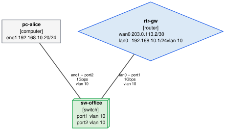

# Getting started

This page is the long walkthrough: it installs netgraph, builds a three-device
inventory one file at a time, validates it, draws it, and then asks it the
questions a diagram cannot answer on its own. It ends with the editor setup that
makes the next inventory quicker to type than this one.

Everything here is done by hand on purpose. `netgraph init` writes the same tree
in one command and `netgraph import` builds it from what your devices already
report — both are shown below — but the shape of a document is worth typing once.

---

## Contents

- [Try it without installing](#try-it-without-installing)
- [Installation](#installation)
  - [Graphviz is a system prerequisite](#graphviz-is-a-system-prerequisite)
  - [On Windows and macOS](#on-windows-and-macos)
- [Faster routes to the same tree](#faster-routes-to-the-same-tree)
- [1. Make a folder](#1-make-a-folder)
- [2. Declare a router](#2-declare-a-router)
- [3. Declare a switch](#3-declare-a-switch)
- [4. Declare a computer](#4-declare-a-computer)
- [5. Connect them](#5-connect-them)
- [6. Check it](#6-check-it)
- [7. Draw it](#7-draw-it)
- [8. Ask questions about it](#8-ask-questions-about-it)
- [Keep the loop running while you edit](#keep-the-loop-running-while-you-edit)
- [Editor setup: autocompletion and inline errors](#editor-setup-autocompletion-and-inline-errors)
- [Where next](#where-next)

---

## Try it without installing

Before spending anything on an install, spend two minutes here:

**<https://blechschmidt.github.io/netgraph/demo/>**

Every example inventory in the repository is published there as a live diagram.
Those pages are not a demo built to look like netgraph — they are the output of
`netgraph render -f html`, the same command [step 7](#7-draw-it) below runs, and
they are rebuilt from `main` on every push. Each one is a single self-contained
file, so everything in it works with the network unplugged.

What to do when you get there:

1. Open **home-lab**. It is a house: a router, a switch, an access point, three
   computers, a server and a USB-to-Ethernet adapter.
2. Use the **layer switcher** at the top. `l1` is the cabling; `l2` adds the
   VLANs to it; `l3` throws the cabling away and draws the IP subnets instead.
   The same files, three questions.
3. **Hover or focus a node.** The panel that opens is every interface, address,
   VLAN and cable that element has — the detail a diagram has no room for, which
   is why netgraph keeps the text and the picture as one thing rather than two.
4. Open **campus** and collapse a site, or **overlay** for VXLAN over IPsec, or
   **patch-room** for the rack elevation and the power feeds.

Then come back and build one of your own. It is the same tool: everything on
those pages came out of the eight steps below, run over
[`examples/`](../examples).

If you would rather not install Python and Graphviz at all, the container is the
other way in — see [docker.md](docker.md).

---

## Installation

netgraph needs **Python 3.10 or newer**.

```bash
pip install -e .            # from a checkout
pip install -e '.[dev]'     # including the development tooling
```

### Graphviz is a system prerequisite

The `svg`, `png`, `pdf` and `html` formats are produced by running the Graphviz
`dot` binary, which is a system package rather than a Python one — so `pip` alone
is not enough:

```bash
sudo apt install graphviz        # Debian / Ubuntu
sudo dnf install graphviz        # Fedora / RHEL
brew install graphviz            # macOS
choco install graphviz           # Windows
```

Check it with `dot -V`. The `dot`, `mermaid` and `json` formats are written by
netgraph itself and work without it — so if you only need DOT output to feed
into another tool, you can skip the install.

### On Windows and macOS

netgraph is tested on `windows-latest` and `macos-14` as well as Linux; see
[testing.md](testing.md) for what each job covers. Everything on this page works
unchanged on all three. Four notes are worth having up front.

**Graphviz is often installed without being on `PATH`.** This is the normal
outcome of the Windows installer and of `choco install graphviz`, and it also
happens on macOS whenever a process was started without `/opt/homebrew/bin` in
its environment — a GUI-launched editor, most often. netgraph therefore looks in
the documented install locations too, so `netgraph render -f svg` usually works
anyway. When it does not, name the binary outright rather than fighting `PATH`:

```powershell
# Windows, PowerShell
$env:NETGRAPH_DOT = 'C:\Program Files\Graphviz\bin\dot.exe'
```

```bash
# macOS
export NETGRAPH_DOT=/opt/homebrew/bin/dot
```

If Graphviz cannot be found at all, netgraph says so and says how to install it
for *your* platform — it does not raise a `FileNotFoundError`.

**Shell completion is a PowerShell script, and it is evaluated rather than
sourced.** One line, and the same line goes in `$PROFILE`:

```powershell
netgraph completion powershell | Out-String | Invoke-Expression
```

See [completion.md](commands/completion.md). `bash`, `zsh` and `fish` are also
generated, which covers Git Bash and WSL on Windows and the default shell on
macOS.

**Line endings.** Everything netgraph writes — a formatted document, a rendered
diagram, an exported artefact, a generated schema — uses `\n` on every platform,
because the canonical form `netgraph fmt` enforces is defined in bytes. If you
keep an inventory in Git on Windows, add a `.gitattributes` next to it so Git
does not translate them back:

```gitattributes
*.yaml text eol=lf
*.yml  text eol=lf
```

Without it, `git config core.autocrlf true` (the Windows default) hands netgraph
CRLF files, `netgraph fmt` rewrites them to LF, and Git reports every file as
modified — a loop that is confusing and entirely avoidable. This repository has
such a file for the same reason.

**`netgraph watch` waits a little longer before re-rendering.** 700 ms of quiet
on Windows and macOS against 300 ms on Linux, because the filesystem-event
backends there deliver one save as events spread over a wider span; a shorter
window would re-render twice per keystroke. `--debounce MS` overrides it.

---

## Faster routes to the same tree

In a hurry? [`netgraph init`](commands/init.md) writes exactly the tree this page
builds — including the editor wiring — and it validates and renders straight
away:

<!-- norun: writes a new inventory into the reader's directory -->

```bash
netgraph init my-network && cd my-network
netgraph validate
netgraph render -f svg -o network.svg
```

Already have a network? [`netgraph import`](importing.md) builds the tree from
output you collect on the devices themselves — LLDP neighbours, `ip -j addr
show`, or the cabling list you already keep — so the first inventory is a diff
away from correct rather than a weekend of typing:

<!-- norun: the first line runs on each device and both use shell redirection -->

```bash
lldpctl -f json > collected/"$(hostname -s)".lldp.json    # on each device
netgraph import -o my-network collected/*.json
```

The rest of this page builds the same thing by hand, which is the part worth
reading once.

---

## 1. Make a folder

```bash
mkdir -p my-network/devices my-network/cables && cd my-network
```

The layout is up to you: netgraph loads every `*.yaml` and `*.yml` under the
root, at any depth. Directories become *namespaces*, so `devices/rtr-gw` is the
full name of the router below, and names only have to be unique within their
own folder. [`docs/inventory-layout.md`](inventory-layout.md) covers the loading
rules, `.netgraphignore` and the layouts that scale past one site.

---

## 2. Declare a router

`devices/rtr-gw.yaml`:

```yaml
apiVersion: netgraph.dev/v1alpha1
kind: router
metadata:
  name: rtr-gw
  labels: {site: office}
  annotations:
    # wan0 faces the ISP, which is not an element of this inventory, so it
    # terminates no cable on purpose.
    netgraph/ignore: NG-C015
spec:
  vendor: MikroTik
  interfaces:
    - name: wan0
      type: ethernet
      description: ISP hand-off
      mtu: 1500
      ipv4:
        addresses: [203.0.113.2/30]
    - name: lan0
      type: ethernet
      description: Downlink to the switch
      mac: '00:1e:8c:aa:00:01'
      mtu: 1500
      ipv4:
        addresses: [192.168.10.1/24]
      vlan:
        mode: access
        access_vlan: 10
  vlans:
    - id: 10
      name: office
```

Every document has the same four keys: `apiVersion`, `kind`, `metadata` and
`spec`. `203.0.113.2/30` is shorthand — write
`{ip: 203.0.113.2, prefix_length: 30}` instead if you prefer it explicit, or
`netmask: 255.255.255.252` if that is how your notes are written. All three
normalise to the same value.

The `netgraph/ignore` annotation is the one line here that is about the
*validator* rather than about the network. `wan0` faces an ISP that this
inventory does not model, so it terminates no cable, and netgraph would otherwise
mention it as `I002` (`NG-C015`, "enabled but terminates no cable"). Annotating
the one element that has a reason is what an exception should look like; turning
the rule off for the whole tree would not be. See
[`docs/validation.md`](validation.md).

---

## 3. Declare a switch

`devices/sw-office.yaml`:

```yaml
apiVersion: netgraph.dev/v1alpha1
kind: switch
metadata:
  name: sw-office
  labels: {site: office}
spec:
  interfaces:
    - name: port1
      type: ethernet
      description: Uplink to rtr-gw
      mtu: 1500
      vlan: {mode: access, access_vlan: 10}
    - name: port2
      type: ethernet
      description: Desk
      mtu: 1500
      vlan: {mode: access, access_vlan: 10}
  vlans:
    - id: 10
      name: office
```

The switch has no IP address at all, which is the point: it is a layer-2
bridge, and its ports carry VLAN membership rather than addressing. (A
management address would go on a `type: vlan` SVI — putting one on a bridge
port is warning `W104`.)

---

## 4. Declare a computer

`devices/pc-alice.yaml`:

```yaml
apiVersion: netgraph.dev/v1alpha1
kind: computer
metadata:
  name: pc-alice
  labels: {site: office}
spec:
  interfaces:
    - name: eno1
      type: ethernet
      mac: '00:1e:8c:bb:00:01'
      mtu: 1500
      ipv4:
        addresses: [192.168.10.20/24]
```

Note what is *absent*: no `vlan` block. The host sends untagged frames and
inherits the VLAN of the access port facing it. That is the expected pairing,
and netgraph knows not to complain about it.

---

## 5. Connect them

`cables/links.yaml` — one file, two documents, separated by `---`:

```yaml
apiVersion: netgraph.dev/v1alpha1
kind: cable
metadata: {name: cbl-rtr-sw}
spec:
  endpoints: [rtr-gw:lan0, sw-office:port1]
  medium: copper
  speed: 1Gbps
---
apiVersion: netgraph.dev/v1alpha1
kind: cable
metadata: {name: cbl-sw-alice}
spec:
  endpoints: [sw-office:port2, pc-alice:eno1]
  medium: copper
  speed: 1Gbps
```

A cable is its own element, not a field on a device. It joins exactly two
interfaces, written as `device:interface`, and the order carries no meaning.

Each cabled interface states `mtu: 1500`, so the two ends of every link agree
and warning `W102` stays quiet.

---

## 6. Check it

<!-- run: cwd=examples/quickstart -->

```console
$ netgraph validate
no problems found
```

Try breaking something — rename `port2` to `port9` in the cable — and you get
the file, the document index, the line, the rule id and a message that lists
the interfaces the switch actually has:

<!-- norun: the transcript is of a deliberately broken copy of the tree -->

```console
$ netgraph validate
errors (1):
  cables/links.yaml#1:9  E001  cable 'cables/cbl-sw-alice' endpoint sw-office:port9: 'devices/sw-office' has no interface 'port9'; it declares 'port1', 'port2'

infos (1):
  devices/sw-office.yaml#0:1  I002  interface 'devices/sw-office:port2' is enabled but terminates no cable; mark it 'enabled: false' if the port is spare

1 error, 1 info
```

`links.yaml#1:9` is the file, the second document in it (0-based) and line 9.
The `I002` below the error is the same mistake seen from the other side: with the
cable pointing at a port that does not exist, `port2` now terminates nothing.

---

## 7. Draw it

<!-- norun: writes a file into the reader's directory -->

```bash
netgraph render -f svg -o topology.svg
```

<p align="center"></p>

That picture is [`docs/images/quickstart.svg`](images/quickstart.svg), rendered
from this very inventory. Without `-o` the diagram goes to standard output,
which is how you check the shape of a small tree without leaving a file behind —
Mermaid is the most readable of the text formats:

<!-- run: cwd=examples/quickstart -->

```console
$ netgraph render -f mermaid
flowchart TB
    n0[/"pc-alice<br/>[computer]<br/>192.168.10.20/24<br/>vlans: 10"/]
    n1(["rtr-gw<br/>[router]<br/>203.0.113.2/30<br/>192.168.10.1/24<br/>vlans: 10"])
    n2["sw-office<br/>[switch]<br/>vlans: 10"]

    n1 -- "lan0 ↔ port1 · 1Gbps" --- n2
    n0 -- "eno1 ↔ port2 · 1Gbps" --- n2

    classDef computer fill:#f5f5f5,stroke:#6b7280,stroke-width:1px
    classDef router fill:#dbe9f6,stroke:#2563eb,stroke-width:1px
    classDef switch fill:#dcf0dc,stroke:#16a34a,stroke-width:1px
    class n0 computer
    class n1 router
    class n2 switch
rendered 3 node(s) and 2 edge(s) as mermaid at layer l1
```

Validation always runs first, so a render either reflects a tree that holds
together or refuses. Layers, filtering, icons and the interactive HTML page are
in [`docs/rendering.md`](rendering.md).

---

## 8. Ask questions about it

The inventory is now a queryable model rather than a picture. `netgraph list`
summarises one kind of thing at a time:

<!-- run: cwd=examples/quickstart -->

```console
$ netgraph list devices
NAME               KIND      PORTS  ADDRESS           VLANS
-----------------  --------  -----  ----------------  -----
devices/pc-alice   computer      1  192.168.10.20/24  10
devices/rtr-gw     router        2  203.0.113.2/30    10
devices/sw-office  switch        2  -                 10
$ netgraph list subnets
SUBNET           IP  ADDRESSES  ELEMENTS  VLANS
---------------  --  ---------  --------  -----
192.168.10.0/24   4          2         2  10
203.0.113.0/30    4          1         1  -
```

Note that nothing in the YAML above declared a subnet: both prefixes were
derived from the addresses on the interfaces. `cables`, `vlans` and `tunnels` are
the other things [`netgraph list`](commands/list.md) will summarise.

And the question the diagram cannot answer on its own:

<!-- path-example -->
<!-- run: cwd=examples/quickstart -->

```console
$ netgraph path pc-alice rtr-gw
devices/pc-alice -> devices/rtr-gw: 1 path
  source       devices/pc-alice  [computer]
  destination  devices/rtr-gw  [router]
  layer        2, switched
  vlan         10 (assumed by the trace)

path 1 of 1 · 2 hops · vlan 10
   1  devices/pc-alice  [computer]
      out eno1                  192.168.10.20/24
      ->  cable cbl-sw-alice  (copper, 1Gbps)  vlan 10
   2  devices/sw-office  [switch]
      in  port2
      out port1
      ->  cable cbl-rtr-sw  (copper, 1Gbps)  vlan 10
   3  devices/rtr-gw  [router]
      in  lan0                  192.168.10.1/24
```

Nothing was pinged: this is a trace over the topology you declared, which is
exactly the thing to compare against what the network does. See
[`docs/paths.md`](paths.md).

`netgraph ipam` grades the address plan rather than listing it — how full each
prefix is, and whether anything overlaps or contradicts:

<!-- run: cwd=examples/quickstart -->

```console
$ netgraph ipam
PREFIX           IP  VLANS  HOSTS  USED  FREE   UTIL  DEVICES
---------------  --  -----  -----  ----  ----  -----  -------
192.168.10.0/24   4  10       254     2   252   0.8%        2
203.0.113.0/30    4  -          2     1     1  50.0%        1

conflicts
no problems found
```

The `/30` reads as half empty because only the router's end of the ISP hand-off
is an element here. [`docs/ipam.md`](ipam.md) explains the sizing rules and the
conflict checks.

Finally, when you want to know what netgraph made of a document — every default
it filled in, every shorthand it expanded — ask it to print the element back:

<!-- run: cwd=examples/quickstart -->

```console
$ netgraph show devices/pc-alice
apiVersion: netgraph.dev/v1alpha1
kind: computer
metadata:
  name: pc-alice
  labels:
    site: office
  annotations: {}
spec:
  interfaces:
  - name: eno1
    type: ethernet
    enabled: true
    mac: 00:1e:8c:bb:00:01
    mtu: 1500
    ipv4:
      enabled: true
      forwarding: false
      mtu: 1500
      addresses:
      - ip: 192.168.10.20
        prefix_length: 24
  vlans: []
  forwarding:
    ipv4: false
    ipv6: false
  netns: []
  vrfs: []
  routes: []
```

`192.168.10.20/24` came back as `{ip: ..., prefix_length: 24}`, and
`enabled: true` was never typed. This is the fastest way to settle an argument
about what a document means — see [`netgraph show`](commands/show.md).

That is the whole loop: write YAML, validate, render. Everything else is detail.

---

## Keep the loop running while you edit

While you are still typing, let netgraph run the loop for you:

<!-- norun: starts a server and does not exit -->

```bash
netgraph watch --serve
```

Every save re-validates and re-renders, and the page at
<http://127.0.0.1:8080/> updates itself. See
[`netgraph watch`](commands/watch.md).

The finished inventory is checked in as
[`examples/quickstart`](../examples/quickstart), and the test suite validates and
renders it on every run — so if you got a different answer than this page
promised, that is a bug in netgraph rather than in your typing.

---

## Editor setup: autocompletion and inline errors

Inventories are written by hand, so the editor is the first place a mistake can
be caught. There are two ways to wire it up, and they compose.

**The language server** is the better one. `netgraph lsp` is a Language Server
Protocol server over stdio, and it answers about the whole folder: the
diagnostics are the ones `netgraph validate` prints, the completion for a cable
endpoint offers the switches you actually have and then the ports they actually
have, hover resolves a reference, and rename rewrites every mention of an
element across every file. [`docs/lsp.md`](lsp.md) has the configuration for
VS Code, Neovim, Helix and Emacs, and [`editors/`](../editors) has a minimal
VS Code client.

**The JSON Schema** is the other, and it needs no netgraph process at all.
`netgraph schema` emits a
[JSON Schema 2020-12](https://json-schema.org/draft/2020-12/release-notes)
document generated from the pydantic models; the yaml-language-server behind
VS Code, Neovim and the JetBrains IDEs turns it into completion, hover
documentation and squiggles under bad values.

<!-- run: cwd=. -->

```console
$ netgraph schema --kind cable
{
  "$schema": "https://json-schema.org/draft/2020-12/schema",
  "$id": "https://netgraph.dev/schema/v1alpha1/cable.json",
  "title": "netgraph cable document",
...
```

A generated copy is committed at
[`schema/netgraph.schema.json`](../schema/netgraph.schema.json), so you can use
it without installing netgraph first — and [`netgraph init`](commands/init.md)
writes one into a new inventory with the modeline below already on every
document, which is the setup-free path.

**Per file, no configuration.** The language server reads a modeline on the
first line:

```yaml
# yaml-language-server: $schema=https://raw.githubusercontent.com/netgraph/netgraph/main/schema/netgraph.schema.json
apiVersion: netgraph.dev/v1alpha1
kind: switch
metadata:
  name: sw-office
```

A relative path (`$schema=../../schema/netgraph.schema.json`) works too and
keeps the tree usable offline.

**Whole tree, in VS Code.** Install the
[YAML extension](https://marketplace.visualstudio.com/items?itemName=redhat.vscode-yaml)
and add one glob to `.vscode/settings.json`:

```json
{
  "yaml.schemas": {
    "./schema/netgraph.schema.json": ["inventory/**/*.yaml"]
  }
}
```

Neovim's `yamlls` and the JetBrains IDEs take the same mapping. Regenerate the
committed copy with `python tools/gen_json_schema.py`; `tests/test_schema.py`
fails when it drifts from the models.

The schema is versioned alongside `apiVersion` — its `$id` is
`https://netgraph.dev/schema/v1alpha1/element.json`, and a future `v1beta1` gets
its own rather than replacing it.

**It does not replace `netgraph validate`.** The schema sees one document at a
time, so it checks structure, value grammars and rules within a single object.
Whether a cable endpoint names an element that exists, whether names are unique,
whether two ends of a link agree on a VLAN — all of that needs the whole tree,
and it is exactly what [`netgraph lsp`](lsp.md) adds on top. Keep running
`netgraph validate` in CI either way.
[`docs/schema.md` §13](schema.md#13-editor-integration) has the full comparison
and the per-kind setup, and [`netgraph schema`](commands/schema.md) has the
command's own options.

---

## Where next

* [`docs/inventory-layout.md`](inventory-layout.md) — how a tree is discovered
  and loaded, namespaces, and the layouts that survive a second site.
* [`docs/validation.md`](validation.md) — the rule catalogue, severities,
  `--strict`, and how to record a deliberate exception.
* [`docs/rendering.md`](rendering.md) — layers, filters, collapsing, icons and
  the interactive HTML output.
* [`docs/paths.md`](paths.md) and [`docs/ipam.md`](ipam.md) — the two analyses
  that read the model rather than draw it.
* [`docs/importing.md`](importing.md) — build the first inventory from LLDP,
  `ip -j addr show` or a spreadsheet instead of from scratch.
* [`docs/configuration.md`](configuration.md) — `netgraph.toml`, per-inventory
  render defaults and named profiles.
* [`docs/ci.md`](ci.md) — validating the inventory and publishing the diagram on
  every push.
* [`docs/schema.md`](schema.md) — the full specification, when a field's exact
  grammar matters.

## See also

* [`netgraph init`](commands/init.md) — the scaffolded version of this page.
* [`docs/inventory-layout.md`](inventory-layout.md) — the next thing to read.
* [`docs/schema-reference.md`](schema-reference.md) — every field of every kind,
  generated from the models.
