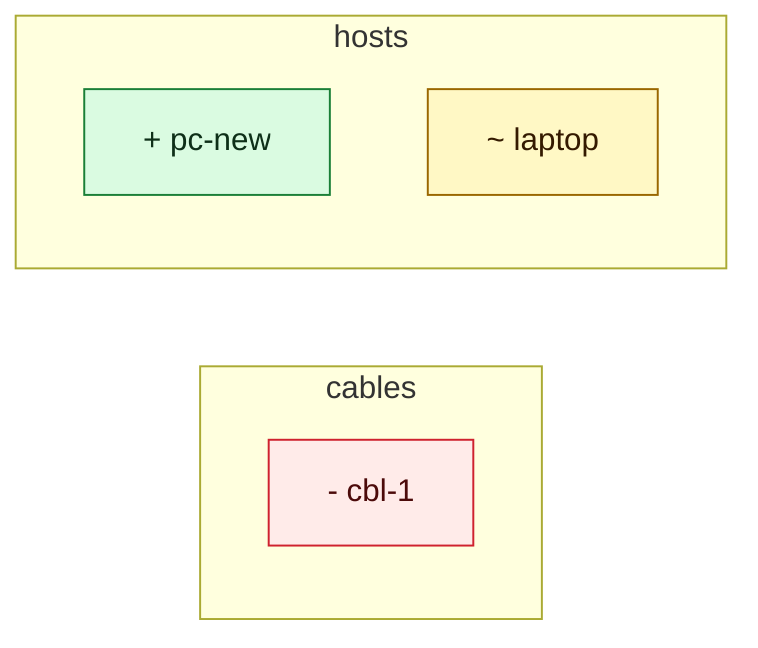

<!-- netviz-review: netviz (home-lab) -->

### ❌ netviz (home-lab) — 3 elements change, **1 new error** introduced

`origin/main` → `this branch` · inventory `inventory`

#### What changes

| Kind | Added | Changed | Renamed | Removed |
|---|---:|---:|---:|---:|
| `cable` | - | - | - | 1 |
| `computer` | 1 | 1 | - | - |
| **total** | 1 | 1 | - | 1 |

3 elements, one by one

| | Element | Kind | Detail |
|---|---|---|---|
| `-` | `cable.cables/cbl-1` | `cable` | element removed |
| `+` | `device.hosts/pc-new` | `computer` | new element |
| `~` | `device.hosts/laptop` | `computer` | `spec.mtu` |

#### Validation

| | Rule | Where | What |
|---|---|---|---|
| ❌ error | [`E001`](https://github.com/blechschmidt/netviz/blob/main/docs/validation-rules.md#e001--unknown-cable-endpoint) | [`inventory/cables/links.yaml:28`](https://github.com/o/r/blob/0123456789abcdef/inventory/cables/links.yaml#L28) | cable 'cables/cbl-1' endpoint pc-desk:eno1: no element named 'pc-desk' |

Also: **1 pre-existing problem fixed** 🎉 and 1 pre-existing finding left alone — the check does not fail on what this change did not do.

#### The change, drawn

📎 [Download the full diagram (SVG, PNG)](https://github.com/o/r/actions/runs/42#artifacts) from `netviz-review`.

netviz 0.1.0 · this comment is edited in place on every push · reproduce it with <code>netviz review --from origin/main</code>
